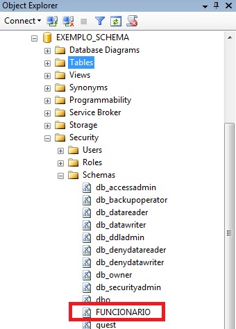

\newpage

# Objetivo

Estudo dirigido de SQL Server.

# Referência

Vídeo aulas "O curso completo de Banco de Dados e SQL, sem mistérios" - Udemy.

\newpage

# Modulo 24 - Instalação e delimitador **GO**

## Instalação
### Instalar SQL-server\
- Versão:\
Versão usada é a express 2019, por ser a versão mais completa gratuita.\

- Ubuntu\
https://docs.microsoft.com/pt-br/sql/linux/quickstart-install-connect-ubuntu?view=sql-server-ver15
\
Basta seguir o passo a passo do site, ou pesquisar por pesquisar por "SQL Server Ubuntu" no youtube e seguir alguns tutoriais.\

- Windows\

### Instalar Azure Data Studio\
- Gerenciador de banco de dados usado para SQL-server, que estou usando no Ubuntu.\
- Onde baixar:\
https://docs.microsoft.com/pt-br/sql/azure-data-studio/download-azure-data-studio?view=sql-server-ver15
\

\newpage

## Acessando **SQL Server** pelo terminal
- Execute o sqlcmd com parâmetros para o nome do SQL Server (-S), o nome de usuário (-U) e a senha (-P). Neste tutorial, você está se conectando localmente, portanto, o nome do servidor é localhost. O nome de usuário é SA (system administrator, equivalente ao root do MySQL) e a senha é a mesma fornecida para a conta SA durante a instalação.\

sqlcmd -S localhost -U SA -P '*YourPassword*'\

- É possível omitir a senha na linha de comando para receber uma solicitação para inseri-la.\

sqlcmd -S localhost -U SA\

## Bancos do sistema
- São os bancos de dados do sistema que armazenam os dicionarios de dados.\
- Bancos de dados do sistema:\
  - **master**\
    - É o banco de dados principal do sistema.\
    - Todas as informações dos outros bancos de dados criados ficam armazenados nele.\
    
  - **model**\
    - São modelos de tabelas e bancos de dados, que ficam armazenados nesse banco de dados.\
    - Pode servir de modelo automatico na criação de uma nova tabela ou banco de dados.\
  
  - **msdb**\
    - Armazenamento de rotinas.\
    - Integrations Services, área de BI (ferramenta de **ETL**).\
    
  - **tempdb**\
    - Bancos de dados temporarios, ele é apagado todo vez que fecha e abre o sistema do banco de dados.\
    - Muito utilizado para agilizar o teste de aplicações.\

\newpage

## Detalhes básicos do **SQL SERVER**
### Inserindo comentarios

- Um comentário é uma seqüência arbitrária de caracteres começando por dois hífens ("\-\-") e prosseguindo até o fim da linha.\
- Como alternativa, podem ser utilizados blocos de comentários no estilo C (/\**bloco de comentarios*\*/). Utilizado para comentar mais de uma linha.\

### Extensão de arquivo script SQL
- O arquivo com o script SQL é salvo em ".sql".\

- As três formas recomendadas de escrever os script's são:
  - **SQL server Management Studio** (**SSMS**)\
  É um gerenciador de bancos de dados oferecidos pela microsoft, ótimo para gerenciar e trabalhar com banco de dados e arquivos ".sql".\
  
  - **Azure**\
  É um gerenciador de banco de dados e oferece ferramentas para o melhor entendimento e programação de um script ".sql".\
  
  - Num arquivo de texto\
  Preferencialmente o programa "**Sublime Text**", pois oferece a opção de escrever e salvar arquivos ".sql" com todas as ferramentas que envolve o processo.\

### Abrindo uma "nova consulta"
- Para começar a escrever um script no **SSMS** é necessario iniciar uma "nova consulta", abrir uma pagina que serve para escrever os comandos SQL.\
- As duas formas de iniciar essa pagina são:\
  - Clickar em nova consulta, parte superior da pagina.\
  - Atalho **CRTL** + **N**\
  
\newpage
  
## Uso do delimitador **GO**

- O **SQL Server** funciona da seguinte forma com seus script's:\
  - Não precisa do delimitador para compilar o código, *processamento assincrono*.\
  - Quando é pedido para compilar todo o script (sem seleções do código e sem uso de delimitador), o **SQL Server** executa o que for mais rapido primeiro, fora de ordem, por conta do *processamento assincrono*.\
  - Ao selecionar uma parte do código ele compila apenas aquela parte do código.\
  - Usando o delimitador **GO** executar o código por partes.\

- Demilitador **GO**\
  - O uso do GO ao final de cada instrução serve como delimitador.\
  - O **GO** quebra o codigo em pequenos pacotes que são enviados para o servidor executar.\
  - Colocando o **GO** no código ao final de cada instrução, o servidor não faz o *processamento assincrono*, assim quebrando o grande pacote que é o script inteiro, em pequenos pacotes para serem executados na ordem de envio.\ 

- Modo de usar:\
  - Colocar o **GO** ao final de cada instrução.\
  - Inserir o **GO** na linha de baixo a instrução.\
  - Sintaxe:\
  **CREATE** **DATABASE** *nome_database*\
  **GO**\
  **USE** *nome_database*\
  **GO**\
  **CREATE** **TABLE** *nome_tabela*(\
  *campo* *tipo*\
  )\
  **GO**\

\newpage

# Modulo 25 - Arquitetura do **SQL Server**

## Acessando arquivos de banco de dados
- Primeiro clickando com botão direito no banco de dados desejado.\
  - Propriedades > Arquivos.\

## Arquitetura do **SQL Server** na maquina
- No Ubuntu os dados de arquitetura ficam gravados no caminho:\
'/var/opt/mssql/data' \

- No Windows os dados de arquitetura ficam gravados no caminho:\
'C:\\Program Files\\Microsoft SQL Server\\MSSQL15.SQLEXPRESS\\MSSQL\\DATA' \

## Tipos de arquivos
- **MDF** (*master data file*)\
  - Armazena dados do sistema (dicionario de dados).\
  - Criação automatica pelo sistema.\
  - Recomenda-se que use o MDF apenas para dados do sistema (mudança manual).\
  - Arquivos **MDF** sempre vão dentro do grupo **PRIMARY**.\
- **LDF** (*log data file*)\
  - Armazena log's, transações, conjuntos de instruções.\
  - Criação automatica pelo sistema.\
  - É apagado quando explicitado (**BEGIN**) a transação, ao finalizada com **COMMIT** (confirmando a transação) ou **ROLLBACK** (desfazendo a transação).\
- **NDF** (*not master data file*)\
  - Não é criado automaticamente pelo sistema (criação manual), diferente dos outros.\
  - Utilizado para armazenar dados.\
  - Podendo armazenar dados atraves de grupos dados (*GP*), para melhor organizar os dados, assim fazendo a separação dos dados por assunto.\
  - Possibilita a separação fisica dos dados em HD.\

\newpage

## **TRANSACTION** - Transação
- É uma instrução que só executa as instruções dentro dela, no caso (**INSERT**, **UPDATE**, **DELETE**, ...), apenas se todas as instruções sejam concluidas com sucesso.\

- Caso alguma instrução dentro dela dê ERRO, tudo é desfeito.\

- Muito util para fazer operações de transação financeira entre contas.\
  - Exemplo de transação financeira, transferencia de dinheiro entre contas:\
    - Subtrair dinheiro de uma conta.\
    - Somar dinheiro em outra conta.\

- **COMMIT** ou **ROLLBACK**: Comandos que finalizam a transação onde o ‘**COMMIT**’ confirma o conjunto de comandos e o ‘**ROLLBACK**’ desfaz todo o processo executado pelo corpo de comandos caso tenha ocorrindo algum evento contrario ao desejado. 

- Sintaxe:\
  **BEGIN** **TRANSACTION** (ou **BEGIN**)\
  UPDATE tabela SET coluna1_a_modificar = expressão1\
  WHERE tabela IN (lista_dos_registros_a_modificar)\
  UPDATE tabela SET coluna2_a_modificar = expressão2\
  WHERE tabela IN (lista_dos_registros_a_modificar)\
  **COMMIT** (ou **ROLLBACK**)\

- Observação: Pode usar **BEGIN** **TRANSACTION** ou apenas **BEGIN**.\

## Função **ERRO**
- No **SQL Server** temos uma função de sistema que faz a endentificação de um erro dentro de uma transação chamada de ‘**\@\@ERROR**’ função essa que por padrão recebe o valor 0 (zero) caso não ocorra nem um erro , no caso de algum erro ela assume o valor 1 (um).\

- Uso da função ‘**\@\@ERROR**’ dentro de um **IF**, para determinar uma *transação* (**TRANSACTION**) pode se mostrar uma boa solução.\

- Sintaxe:\
**BEGIN** **TRANSACTION**\
**UPDATE** **FROM** *tabela*\
**SET** *campo_1* = 10.000\
**WHERE** *campo_1* < 50\
**IF** **\@\@ERROR** = 0\
**COMMIT**\
**ELSE**\
**ROLLBACK**\
**END**\

\newpage

## Criando Grupos de arquivos

### Criando grupos de dados apartir de um novo banco de dados

- Clickar com o botão direito no "Banco de dados", na aba "Pesquisador de objetos".\
- Opção "novo banco de dados".\
- Na aba "Geral" pode dar nome para o banco de dados criado.\
- Na aba "Grupos de arquivos" é onde é criado os grupos de arquivos.\
  - O botão "adicionar grupo de arquivos" cria um novo grupo de arquivo.\
  - Podemos nomear esse novo grupo, a boa pratica indica sempre começar com o prefixo "GA_" (abreviação de "grupo de arquivo"), depois o nome grupo.\
  - A opção "PADRÃO" indica que todos os arquivos não espeficiados o grupo, vai cair nesse grupo. Não deixar ele marcado em **PRIMARY**, pois esse grupo é para pertencer apenas os **MDF** - *dicionarios do sistema*.\
- Criar arquivos de banco de dados **NDF**:
  - Na aba "Geral", clickar no botão "adicionar" para criar um novo "arquivo de banco de dados".
  - Em "Nome" nomear esse novo arquivo pela categoria (setor, ...).\
  - Em "Nome do Arquivo" repetir o nome + o sufixo ".ndf".\
  - Em "Grupo de Arquivos" direcionar para o grupo desejado (criado anteriormente).\
  - Em "Aumento Automático/Tamanho Máximo" podemos determinar o crescimento do banco de dados cada vez que ele atinge o limite, e determinar um tamanho máximo para o banco de dados (quando ele atinge o tamanho máximo, o banco de dados para).\
- "OK" para confirmar as criações no final.\
  
### Criando grupos de dados em bancos de dados existentes

- Clickar com o botão direito no Banco de dados desejado, na aba "Pesquisador de objetos".\
- Na opção "Propriedades".\
- Na aba "Grupos de arquivos" é onde é criado os grupos de arquivos.\
  - O botão "adicionar grupo de arquivos" cria um novo grupo de arquivo.\
  - Podemos nomear esse novo grupo, a boa pratica indica sempre começar com o prefixo "GA_" (abreviação de "grupo de arquivo"), depois o nome grupo.\
  - A opção "PADRÃO" indica que todos os arquivos não espeficiados o grupo, vai cair nesse grupo. Não deixar ele marcado em **PRIMARY**, pois esse grupo é para pertencer apenas os **MDF** - *dicionarios do sistema*.\
- Criar arquivos de banco de dados **NDF**:
  - Na aba "Arquivos", clickar no botão "adicionar" para criar um novo "arquivo de banco de dados".
  - Em "Nome" nomear esse novo arquivo pela categoria (setor, ...).\
  - Em "Nome do Arquivo" repetir o nome + o sufixo ".ndf".\
  - Em "Grupo de Arquivos" direcionar para o grupo desejado (criado anteriormente).\
  - Em "Aumento Automático/Tamanho Máximo" podemos determinar o crescimento do banco de dados cada vez que ele atinge o limite, e determinar um tamanho máximo para o banco de dados (quando ele atinge o tamanho máximo, o banco de dados para).\
- "OK" para confirmar as criações no final.\

## Direcionando dados de tabela para grupos de arquivos (**NDF**)

- Clickar com o botão direito na tabela desejada.\
- Na opção"design".\
- Na aba de "Propriedades".\
  - Dentro de "Identidade", em "Nome" podemos alterar o nome da tabela.\
  - Dentro de "Designer de tabela", dentro de "Especificação de Espaço de Dados Regular", em "Nome do Esquema de Partição ou Grupo de Arquivos" podemos selecionar um grupo de arquivos criado anteriormente para enviar a tabela.\
  - Dentro de "Designer de tabela", em "Grupo de Arquivos de Texto/Imagem" caso o banco de dados salve arquivos do tipo texto (.doc ou .odt) e imagem (pdf, jpeg ou .png) pode direcionar para ser salvo dentro de um grupo de arquivos criado anteriormente, podendo ser um grupo diferente do tópico anterior.\

\newpage

# Tipos de dados

## Numéricos exatos

- *bigint*\
  - Inteiro, porem com espaço de armazenamento dobrado do *int*, 8bytes.\

- *numeric*\
  - *float* com números exatos, sem arredondamento.\
  - Recebe como argumentos, tamanho total do numero e o numero de casas decimais.\
  - Sintaxe:\
  *numeric*(*n_total*,*n_deci*)\
  
- *bit*\
  - Valores de cadeias de caracteres '**TRUE**' e '**FALSE**', podem ser convertidas em bit.\
  - 1 (ou qualquer valor diferente de 0) é **TRUE**.\
  - 0 é **FALSE**.\

- *smallint*\
  - Inteiro, porem com espaço de armazenamento pela metade do *int*, 2bytes.\
  
- *decimal*\
  - Igual a *numeric*.\

- *int*\
  - Número inteiro.\
  - Espaço de armazenamento de 4bytes.\
  
- *tinyint*\
  - Inteiro num intervalo de 0 a 255.\
  - Usado para armazenar idade de pessoas.\

- *money*\
  - Apresenta valores monetários, duas casas decimais.\
  - Não é muito útil, melhor usar outro tipo em situação normal (*numeric* ou *float*).\

## Numéricos aproximados

- *float*\
  - Dado do tipo "ponto flutuante", são valores aproximados.\
  - Varia entre precisão de 7 a 15 digitos, dependendo do valor de "n" especificado (variando entre 1 a 24 para 7 digitos e 25 a 53 para 15 digitos.).\
  
- *real*\
  - Igual a *float*(24).\

## Data e hora

- *date*\
  - Usado para armazenar datas.\
  - No formato: "AAAA-MM-DD".\
  
- *datetimeoffset*\
  - Com as vantagens do *datetime2*, somado ao reconhecimento de fuso horário com base no UTC.\
  - No formato: "AAAA-MM-DD hh:mm:ss.nnnnn +/-hh:mm".\

- *datetime2*\
  - Apresenta um intervalo de datas maior que *datetime*.\
  - Uma precisão fracionada padrão dos segundo maior que *datetime*.\
  - Precisão opcional especificada pelo usuário. Podendo usar menos armazenamento.\

- *smalldatetime*\
  - Arredonda *datetime*.\
  - Usa o mesmo formato que *datetime*.\

- *datetime*\
  - Usado para armazenar data e horário.\
  - No formato: "AAAA-MM-DD hh:mm:ss.nnnnn".\

- *time*\
  - Usado para armazenar horário.\
  - No formato: "hh:mm:ss.nnnnn".\

## Cadeias de caracteres

- *char*\
  - Aceita somente determinado número de caracteres estabelecidos, tamanho fixo.\
  - Sintaxe:\
  char(3)\
  
- *varchar*\
  - Aceita número de caracteres variável, determinar tamanho máximo.\
  - Sintaxe:\
  varchar(50)\
  
- *text*\
  - *text* é usado para grandes pedaços de dados de *string*. Se o comprimento do texto exceder um determinado limite, o texto será armazenado fora da linha.\
  - Usado se precisar armazenar textos grandes no seu banco de dados.\
  - Sintaxe:\
  *text* (*tamanho_max_string*)\

## Cadeias de caracteres Unicode

- *nchar*(n)\
  - O valor "n" é referente a quantidade de bytes necessarios para o armazenamento, de valor fixo.\

- *nvarchar*(n)\
  - O valor "n" é referente a quantidade de bytes necessarios para o armazenamento, de valor variável.\

- *ntext*\
  - Usado se precisar armazenar textos grandes no seu banco de dados.\
  - "n" é referente a quantidade de bytes necessarios para o armazenamento.\

## Cadeia de caracteres binária

- *binary*\
  - Usado para armazenar valores binarios de valor fixo.\
  - "n" é o numero de bytes.\
  
- *varbinary*\
  - Usado para armazenar valores binarios de valor variável.\
  - "n" é o numero de bytes.\

- *imagem*\
  - Dados binarios de comprimento variavel.\
  - Salva imagem.\

## Outros tipos de dados

- *cursor*\
- *rowversion*\
- *hierarchyid*\
- *uniqueidentifier*\
- *sql_variant*\
- *xml*\
- *table*\

\newpage

# Modulo 26 PARTE 1 - Comandos básicos, **CONSTRAINTS** e descrição de tabelas

## Comandos básicos

- **CREATE DATABASE**\
  - Criação de banco de dados.\
  - Sintaxe:\
  **CRIATE DATABASE** *nome_database*\
  **GO**\

- **DROP DATABASE**\
  - Apaga um banco de dados e tudo esta contido dentro.\
  - Sintaxe:\
  **DROP DATABASE** *nome_database*\
  **GO**\

- **USE** \
  - Conectando a um banco de dados.\
  - Sintaxe:\
  **USE** *nome_database*\
  **GO**\
  
- **CREATE TABLE**\
  - Criação de banco de dados.\
  - Sintaxe:\
  **CREATE TABLE** *nome_tabela*(\
  *coluna1* *tipo* *regras*,\
  ...\
  )\
  **GO**\

- **DROP TABLE**\
  - Apaga uma tabela.\
  - Sintaxe:\
  **DROP TABLE** *nome_da_tabela*\
  **GO**\

- **ALTER TABLE**\
  - Adiciona regras (**CONSTRAINT**) a tabelas.\
  - É uma boa prática o uso de **ALTER TABLE** para normalizar o nome salvo das regras no sistema. Facilita a pesquisa posteriormente.\
  - Sintaxe:\
  **ALTER TABLE** *nome_tabela*\
  **ADD CONSTRAINT** *nome_regra*\
  [*regra a ser implementada*]\
  **GO**\
  - Observação: o *nome_regra* (nome da regra) é o nome que fica salvo no **dicionario de dados** (sistema).\

- **INSERT**\
  - Inserindo novos registros numa tabela.\
  - No **SQL Server**, diferente do **MySQL**, nas colunas **PK** (**PRIMARY KEY**) com **IDENTITY** não precisa passar nenhum valor (nem **NULL**), o sistema já entende que vai haver preenchimento e incrementação automatica dos valores.\
  - Os valores que vão ser inseridos do *tipo* *String* (*char*, *varchar*, ...) ou *DATE* devem ser passados entre aspas simples('*valor*').\
  - Sintaxe:\
  **INSERT INTO** *nome_tabela*\ 
  **VALUES**\
  (*valor_coluna1*, *valor_coluna2*,*valor_coluna3*,*valor_coluna4*, ...),\ 
  ...\
  (*valor_coluna1*, *valor_coluna2*,*valor_coluna3*,*valor_coluna4*, ...)\ 
  **GO**\

- **DELETE**\
  - Apaga os registro de uma tabela.\
  - Quando usado em conjunto com WHERE, apaga apenas os registros determinados por uma condição.\
  - Sintaxe:\
  **DELETE FROM** *nome_tabela*\
  **WHERE** *condição*\
  **GO**\

- **UPDATE**\
  - Altera os registros de uma tabela.\
  - Quando usado em conjunto com WHERE, altera apenas determinados registros definidos por uma condição\
  - Sintaxe:\
  **UPDATE** *tabela_nome*\
  **SET** \
  *coluna_1* = *valor_1*,\
  *coluna_2* = *valor_2*,\
  ... \
  **WHERE** *condição*\
  **GO**\

\newpage

## Regras/Restrições - **CONSTRAINTS**

- Uma boa prática é criar as **CONSTRAINTS** por fora da tabela, para ter o controle dos nomes das *restrições* que ficaram salvas no dicionario de dados (sistema).\
  - Normalmente com uso de **ALTER TABLE**.\

### **IDENTITY**

- Exerce a mesma função que **AUTO_INCREMENT** no **MySQL**, incrementar automaticamente a coluna determinada.\
- Trás de novo a opção de argumentos "**IDENTITY**(*1º_nº*,*2º_nº*)":\
  - O primeiro número é onde começa.\
  - O segundo numero é quanto incrementa a cada vez.\
- É possivel suprimir os argumentos, onde "**IDENTITY** = **IDENTITY**(1,1)".\
- No **SQL Server**, diferente do **MySQL**, quando feito o **INSERT** de dados no campo onde tem **IDENTITY** não precisa entrar com valor nenhum (nem **NULL**), basta ignorar este campo, o **SQL Server** entende automaticamente que é para preencher ele.\
- Sintaxe:\
   **CREATE TABLE** *nome_tabela*(\
  *coluna1* *int* **PRIMARY KEY** **IDENTITY**(100,10),\
  ...\
  )\
  **GO**\
- Observação: A *coluna1* começa em 100 e recebe o incremento de 10 em 10 a cada novo dado.\

\newpage

### **CONSTRAINTS**
- **PRIMARY KEY** (**PK**)\
  - Toda tabela necessita de pelo menos um campo que identifique todo registro como sendo único (é o que chamamos de “*Chave Primaria*” ou “**Primary Key**”).\
  - Sintaxe:\
  **ALTER TABLE** *nome_tabela*\
  **ADD CONSTRAINT** **PK_***nome_tabela* \
  **PRIMARY KEY** (*coluna*)\
  **GO**\

- **FOREIGN KEY** (**FK**)\
  - Cria uma relação entre duas tabelas, atraves de uma *chave estrangeira* na tabela.\
  - Sintaxe:\
  **ALTER TABLE** *nome_tabela*\
  **ADD CONSTRAINT** **FK_***tabela-recebe*_*tabelare-referenciada*\
  **FOREIGN KEY** (*coluna_FK*)\
  **REFERENCES** *tabela_referenciada*(*coluna_referenciada*)\
  **GO**\
  - Observações:
    - A *tabela-recebe* é a tabela que vai receber a regra **FK**.\
    - A *coluna_FK* é a coluna especifica na tabela, que recebe a regra, que vai servir para fazer a ligação (relação).\
    - As *tabela_referenciada* e *coluna_referenciada* é respectivamente referente a tabela e coluna que serão referenciadas pela ligação (relação) **FK**, ou seja, são as que não recebem a regra.\

- **CHECK** (**CK**)\
  - Verifica (checa) se determinada coluna os valores dos dados são iguais aos especificados em uma lista.\
  - Um substituto no **SQL Server** ao **ENUM** no **MySQL**.\
  - Pode ser usado tanto na criação de tabela (**CREATE TABLE**) quanto na alteração de tabelas (**ALTER TABLE**).\
  - Sintaxe:\
  **ALTER TABLE** *nome_tabela*\
  **ADD CONSTRAINT** **CK_***nome_tabela*\
  **CHECK** (*nome_coluna* **IN** ('*valor1*','*valor2*'))\
  **GO**\

- **UNIQUE** (**UQ**)\
  - A *restrição* **UNIQUE** garante que todos os valores em uma coluna sejam diferentes.\
  - Sintaxe:\
  **ALTER TABLE** *nome_tabela*\
  **ADD CONSTRAINT** **UQ_***nome_tabela*\
  **UNIQUE** (*coluna_recebe_UQ*)\
  **GO**\

\newpage

## Comandos de descrição tabelas - **SP_**

- No **SQL Server** a descriação de uma tabela é atraves de **PROCEDURES** (funções).\
- **PROCEDURES** já criadas e armazenadas no sistema, "**STORAGE PROCEDURES**" (**SP**).\

### **SP_COLUMNS** 

- **SP_COLUMNS** é igual a **DESC**, no **MySQL**.\
- Faz uma descrição da tabela:\
  - Nome das colunas\
  - *Tipo* de cada coluna\
  - *Regras* em cada coluna\
  - ...\
- Sintaxe:\
**SP_COLUMNS** *nome_tabela*\
**GO**\

### **SP_HELP**

- **SP_HELP** é igual ao **SHOW CREATE TABLE**, no **MySQL**.\
- Faz uma descrição mais detalha da tabela que **SP_COLUMNS**:\
  - Quem criou a tabela.\
  - Permissões.\
  - Datas importantes (criação e modificação).\
  - ...\
- Sintaxe:\
**SP_HELP** *nome_tabela*\
**GO**\

### **SP_HELPTEXT**

- Exibe a definição de uma regra definida pelo usuário.\
  - **TRIGGERS**\
  - **PROCEDURES**\
  - **VIEWS**\
  - **FUNCTIONS**\

- É utilizada para podermos visualizar códigos criados dentro da base de dados.\

- O código é exibido no formato, cada linha é um registro.\

- Sintaxe:\
**SP_HELPTEXT** '[*schema.*]*nome_objeto*'\
**GO**\
  - Objeto é o nome da regra definida pelo usuário (**TRIGGER**, **PROCEDURES**,**VIEWS**, **FUNCTIONS**, ...).\
  - Colocar entre aspas simples o nome do objeto.\

\newpage

# Modulo 26 PARTE 2 - Funções, Projeções, Seleções e Junções

## Funções

### Funções usuais

- **ISNULL**()\
  - Trata os valores **nulos**, na coluna especificada, na consulta.\
  - Equivalente do **IFNULL**() do **MySQL**.\
  - Dentro do **ISNULL**(), os argumentos são:\ 
    - *Nome da coluna* a ser avaliada.\
    - *Texto* se o valor for **nulo**.\
  - Dentro do **ISNULL**() usar aspas simples ('').\
  - Sintaxe:\
  **SELECT** \
  **A**.*coluna1*,\ 
  **ISNULL**(**T**.*coluna2*, 'SEM') **AS** "*alias1*", \
  **ISNULL**(**T**.*coluna3*, 'SEM_NUMERO') **AS** "*alias2*",\ 
  **FROM** *tabela1* **A**\
  **LEFT JOIN** *tabela3* **T**\
  **ON** **A**.*coluna***PK** = **T**.*coluna***FK**\
  **GO**\

- **PRINT** '*mensagem*'\
  - Imprime na tela uma mensagem, colocado entre aspas simples ('').\
  - Pode ser usado dentro de **TRIGGERS** e **PROCEDURES** para passar alguma informação importante ao usuário.\
  - Sintaxe com exemplo:\
  **CREATE** **TRIGGER** *nome_da_trigger*\
  **ON** *DBO.tabela*\
  **FOR** **UPDATE**\
  **AS**\
  ... \
  **PRINT** '*TRIGGER EXECUTADO COM SUCESSO*'\
  **GO**\

- **\@\@IDENTITY**\
  - O comando **SELECT \@\@IDENTITY** retorna o último **IDENTITY** gerado pela seção.\
  - Uma ótima opção para recuperar um **IDENTITY** que acaba de ser gerado em algum procedimento.\
  - **PROCEDURES** (funções) podem se utilizar desta função no caso de uma **PROCEDURE** que insira dados numa tabela.\

\newpage

### Funções de auditoria

- **SUSER_NAME**()\
  - Função que retorna o usuario logado no banco de dados no momento.\
  - Útil para usar dentro de **TRIGGERS** para salvar o usuario reponsavel por alguma alteração numa tabela (audutoria).\
  - Sintaxe:\
  **SELECT** **SUSER_NAME**()\
  **GO**\

- **GETDATE**()\
  - Pega a data no sistema (data e horário).\
  - Util para usar dentro de **TRIGGERS** para salvar a data e horario de alguma alteração numa tabela (auditoria).\
  - Formato:\
  "aaaa-mm-dd hh:mm:ss.mmm"\
  - Sintaxe:\
  **SELECT** **GETDATE**()\
  **GO**\
  
\newpage

### Funções de datas

- **GETDATE**()\
  - Pega a data no sistema (data e horário).\
  - Formato:\
  "aaaa-mm-dd hh:mm:ss.mmm"\

- **DATEDIFF**()\
  - Calcula a diferença entre duas datas.\
    - Retorna um valor inteiro (*INT*), dia (*DAY*), ou mês (*MONTH*), ou ano (*YEAR*), ou dia da semana (*WEEKDAY*).\
    - Sintaxe:\
    **DATEDIFF**(*intervalo*, *data_inicio*, *data_termino*)\
      - *intervalo*, indica a função com que parametro estou trabalhando (*day*, *month*, *year*, *weekday*)\
  - Outras funções podem se usadas em conjunto, como parametros, para ajudar a fazer os cálculos.\
    - Comummente usada em conjunto com **GETDATE**() para cálcular idade.\
    - Sintaxe:\
    **DATEDIFF**(*intevalo*,*data_inicio*, **GETDATE**())\
      - a função **GETDATE**(), data atual, entra no lugar do parametro *data de termino*, cálculando assim a idade atual.\
    
- **DATENAME**()\
  - Retorna o nome da parte da data em questão. (ex.: nome do mês)\
  - Retorna uma *string*.\
  - Sintaxe:\
  **DATENAME**(*intervalo*, *data*)\
    - *intervalo*, indica a função com que parametro estou trabalhando (*day*, *month*, *year*, *weekday*)\

- **DATEPART**()\
  - Função parecida com **DATENAME**(), porem retorna um inteiro (*INT*).\
  - Retorna uma parte da data.\
  - Sintaxe:\
  **DATEPART**(*intervalo*, *data*)\
    - *intervalo*, indica a função com que parametro estou trabalhando (*day*, *month*, *year*, *weekday*)\

- **DATEADD**()\
  - Retorna uma data somada a outra data.\
  - Sintaxe:\
  **DATEADD** (*intervalo*, *incremento_INT*, *data*)\
    - *intervalo*, indica a função com que parametro estou trabalhando (*day*, *month*, *year*, *weekday*)\
    - *incremento_INT*, com base no parametro informado pelo *intervalo*, quanto deve ser somado (valor *INT*).\
    - *data*, data a ser incrementada.\

- **DAY**()\
  - Recebe como argumento uma data, formato do sistema.\
  - Retorna o dia (**DAY**) contido na data.\
  - Sintaxe:\
  **DAY**(*data*)\

- **MONTH**()\
  - Recebe como argumento uma data, formato do sistema.\
  - Retorna o mês (**MONTH**) contido na data.\
  - Sintaxe:\
  **MONTH**(*data*)\

- **YEAR**()\
  - Recebe como argumento uma data, formato do sistema.\
  - Retorna o ano (**YEAR**) contido na data.\
  - Sintaxe:\
  **YEAR**(*data*)\

\newpage

## Projeção, seleção e Junção - **SELECT**, **WHERE** e **JOIN**

Principais passos de uma consulta.\

### PROJEÇÃO

- O primeiro passo de uma consulta é montar o que quer ver na tela - **SELECT**.\
- É tudo que você quer ver na tela.\
- Sintaxe comentada:\
**SELECT** *coluna_1* (PROJEÇÃO)\
**FROM** *tabela* (ORIGEM)\
**GO**\
ou\
**SELECT** 2+2 **AS** *alias* (PROJEÇÃO)\
**GO**\

- É possivel mostrar mais de uma consulta ao mesmo tempo.\
  - Sintaxe comentada:\
  **SELECT** \* **FROM** *tabela_1* (PROJEÇÃO 1)\ 
  **SELECT** \* **FROM** *tabela_2* (PROJEÇÃO 2)\
  **GO**\

Obs.: o que esta entre parênteses é comentario.\

\newpage

### SELEÇÃO

- O segundo passo de uma consulta é a seleção dos dados de uma consulta - **WHERE**.\
- É filtrar.\
- Trazer um subconjunto do conjunto total de registros de uma tabela.\
- Sintaxe comentada:\
**SELECT** *coluna_1*, *coluna_2*, *coluna_3* (PROJEÇÃO)\
**FROM** *tabela* (ORIGEM)\
**WHERE** *critero* **=** *valor_do_criterio* (SELEÇÃO)\
**GO**\
Obs.: o que esta entre parênteses é comentario.\

\newpage

### JUNÇÃO

#### Junção forma errada - gambiarra

- Usa seleção como uma forma de juntar tabelas.\
- Como conseguencia:\
  - Uso de operadores lógicos para mais criterios de seleção - **WHERE**.\
  - Ineficiencia na pesquisa, maior custo computacional.\
- Sintaxe comentada:\
**SELECT** *coluna1_tab1*, *coluna2_tab1*, *coluna1_tab2* (PROJEÇÃO)\
**FROM** *tabela1*, *tabela2* (ORIGENS)\
**WHERE** *chave_primaria_tab1* **=** *chave_estrangeira_tab2*(JUNÇÃO)\
**GO**\
ou\
**SELECT** *coluna1_tab1*, *coluna2_tab1*, *coluna1_tab2* (PROJEÇÃO)\
**FROM** *tabela1*, *tabela2* (ORIGENS)\
**WHERE** *chave_primaria_tab1* **=** *chave_estrangeira_tab2* (JUNÇÃO)\
**AND** *criterio* **=** *valor*(SELEÇÃO com operador lógico)\
**GO**\
Obs.: o que esta entre parênteses é comentario.\

#### Junção forma certa - **JOIN**

- Junção **JOIN**, junta duas ou mais tabelas apartir das colunas de *chaves primarias* e *chaves estrangeiras*.\

- Admite seleção - **WHERE** - sem maiores custos computacionais.\

1. **INNER**\

- Exclui os registros sem par (orfans) na outra tabela - **INNER**.\

- Consulta com duas tabelas.\
  - Sintaxe comentada:\
  **SELECT** *coluna1_tab1*, *coluna2_tab1*, *coluna1_tab2* (PROJEÇÃO)\
  **FROM** *tabela1* (ORIGEM)\
  **INNER** **JOIN** *tabela2* (JUNÇÃO)\
  **ON** *chave_primaria_tab1* **=** *chave_estrangeira_tab2*\
  **WHERE** *criterio* **=** *valor* (SELEÇÃO)\
  **GO**\

2. **LEFT**\

- Mostra ate os registros sem par (nulos) - **LEFT**.\
  - Comum usar a função *ISNULL*() para tratar os valores nulos.\

- Consulta com duas tabelas.\
  - Sintaxe comentada:\
  **SELECT** *coluna1_tab1*, *coluna2_tab1*, *coluna1_tab2* (PROJEÇÃO)\
  **FROM** *tabela1* (ORIGEM)\
  **LEFT** **JOIN** *tabela2* (JUNÇÃO)\
  **ON** *chave_primaria_tab1* **=** *chave_estrangeira_tab2*\
  **WHERE** *criterio* **=** *valor* (SELEÇÃO)\
  **GO**\

\newpage

#### Cláusulas ambíguas e Ponteiramento

- Consulta com mais de duas tabelas.\
  - Pode apresentar colunas/campos com o mesmo nome, de tabelas diferentes. Caso comum das *chaves estrangeiras* (**FK**).\
  - Indicar de onde vem cada coluna atraves de "*nome_da_tabela*.*nome_da_coluna*".\
  - Sintaxe comentada:\
  **SELECT** \
  *tabela1*.*coluna1_tab1*,\
  *tabela1*.*coluna2_tab1*,\
  *tabela2*.*coluna1_tab2*,\
  *tabela3*.*coluna1_tab3*  (PROJEÇÃO)\
  **FROM** *tabela1* (ORIGEM)\
  **LEFT** **JOIN** *tabela2* (JUNÇÃO)\
  **ON** *tabela1*.*chave_primaria_tab1* **=** *tabela2*.*chave_estrangeira_tab2*\
  **INNER** **JOIN** *tabela3* (JUNÇÃO)\
  **ON** *tabela1*.*chave_primaria_tab1* **=** *tabela3*.*chave_estrangeira_tab3*\
  **WHERE** *criterio* **=** *valor* (SELEÇÃO)\
  **GO**\
  Obs.: o que esta entre parênteses é comentario.\

- Ponteiramento (alias para tabelas)\
  - Melhora a performance da consulta.\
  - Sintaxe comentada:\
  **SELECT** \
  *A*.*coluna1_tab1*,\
  *A*.*coluna2_tab1*,\
  *B*.*coluna1_tab2*,\
  *C*.*coluna1_tab3*\
  **FROM** *tabela1* *A* (PONTEIRAMENTO DA TABELA 1)\
  **LEFT** **JOIN** *tabela2* *B* (PONTEIRAMENTO DA TABELA 2)\
  **ON** *A*.*chave_primaria_tab1* **=** *B*.*chave_estrangeira_tab2*\
  **INNER** **JOIN** *tabela3* *C* (PONTEIRAMENTO DA TABELA 3)\
  **ON** *A*.*chave_primaria_tab1* **=** *C*.*chave_estrangeira_tab3*\
  **WHERE** *criterio* **=** *valor*\
  **GO**\

\newpage

# Modulo 26 PARTE 3 - Conversão de tipo de dados

## Conversão de dados automatica pelo sistema
- Conversões de *TIPO* que o **SQL Serve** faz automaticamente pelo sistema.\
- Existe um direcionamento em que o sistema costuma forçar de **STRING** para **INT**, nunca o contrario de maneira automatica.\
- O simbolo '+', alem de operador matemático, funciona como concatenador.\
  - Sintaxe:\
  **SELECT** '1' + '1'\
  **GO**\
  (Retorno '11')\

\newpage

## Tabela de conversões de dados automatico pelo sistema

{height=15cm} \

- *Conversão implicita*.\
  - São conversões automaticas pelo sistema.\
- *Conversão explicita*.\
  - São conversões por meio de funções. (Ex.: **CAST**())\

\newpage

## Funções de conversão

- **CAST**()\
  - A função **CAST**() converte um valor (de qualquer tipo) em um tipo de dados especificado.\
  - O tipo de dados para converter a expressão, pode ser um dos seguintes:\
    - **BIGINT**\
    - **INT**\
    - **SMALLINT**\
    - **TINYINT**\ 
    - **BIT**\
    - **DECIMAL**\ 
    - **NUMERIC**\
    - **MONEY**\
    - **SMALLMONEY**\ 
    - **FLOAT**\
    - **REAL**\
    - **DATETIME**\
    - **SMALLDATETIME**\ 
    - **CHAR**\
    - **VARCHAR**\ 
    - **TEXT**\
    - **NCHAR**\
    - **NVARCHAR**\ 
    - **NTEXT**\
    - **BINARY**\
    - **VARBINARY**\ 
    - **IMAGE**\
  - *Expressões* do tipo **STRING** devem entrar entre aspas simples ('').\
  - Sintaxe:\
  **SELECT**\
  **CAST**(*expressão* **AS** *TIPO_especificado*)\
  **GO**\
  ou\
  **CAST**(*\@variável* **AS** *novo_tipo*)\
  **GO**

- **CONVERT**()\
  - Assim como **CAST**, converte os tipos dos dados, porem com mais recursos para converter tipos data (**DATETIME**, **DATE**, ...) em **VARCHAR** de algum formato de data espefico.\
  - A função mais recomendada para converter tipos data (**DATETIME**, **DATE**, ...) em tipo **VARCHAR**.\
  - Os códigos dos formatos de date podem ser obtidos na documentação, porem os principais códigos são:\
    - 105\
    Código do formato **DATE** PT-BR, sem horas.\
    - 120\
    Código do formato **DATETIME** ENG, sem milésimos.\
    - 121\
    Código do formato **DATETIME** ENG, com milésimos.\
  - Sintaxe:\
  **DECLARE** *\@variável* tipo\
  **CONVERT**(novo_tipo, *\@variável*)\
  **GO**\
  ou\
  **DECLARE** *\@variável* **DATETIME**\
  **CONVERT**(**VARCHAR**, *\@variável*, *código_do_formato*)\
  **GO**\

- **CHARINDEX**()\
  - Retorna um numero inteiro de acordo com a posição de determinada caracter num **VARCHAR**.\
    - As posições no VARCHAR começam a ser contadas a partir da posição 1.\
    - O retorno 0, é caso não tenha achado nenhum caracter procurado.\
  - Os argumento do CHARINDEX(*o que procurar?*, *onde procurar?*, *a partir de tal posição?*)\
    - *O que procurar?*\
    O caracter que deve ser encontrado.\
    - *onde procurar?*\
    O **VARCHAR** que deve ser percorrido procurando o caracter.\
    - *a partir de tal posição?*\
    A partir de qual posição a busca deve começar. As posições do VARCHAR começam a ser contadas a partir da posição 1.\
    Pode omitir esse ultimo argumento, a função entenderá como começando da posição 1 (a inicial).\
  - Sintaxe:\
  **SELECT**\
  **CHARINDEX**('*caracter*',*sting*, *numero_da_posição_inicial_procura*) **AS** '*alias*'\
  **FROM** *tabela*\
  **GO**\
  
\newpage

# Modulo 26 PARTE 4 - Importação de arquivo de dados

## Aspacetos importantes da importação de Arquivos
- Além da função de importação de arquivo (**BULK INSERT**), é necessario antes, montar uma estrutura preparada para receber os dados do arquivo (criação de **BANCO DE DADOS** e **TABELAS** para recerber os dados).\
  - Sintaxe:\
  **CREATE DATABASE** *nome_database*\
  **GO**\
  **CREATE TABLE** *tabela*(\
  *campo1* *tipo* *regra*,\
  *campo2* *tipo* *regra*,\
  ... \
  )\
  **GO**\
- Outro aspecto importante é como esta organizado os dados no arquivo importados.\
  - A organização dos dados, no arquivo, interfere diretamente no processo de importação do arquivo.\
  - Partes em branco, dentro do arquivo, provavelmente resultarão em registros *nulos* (**NULL**), quando não em erro.\
  - É importante para importação conhecer os caracteres de comando da tabela **ASCII**, são necessarios como argumentos da função **BULK INSERT**.\
  
```{r, echo=FALSE}
Nome_na_ASC <- c("nul", "bel", "bs", "ht", "np", "nl", "cr", "vt")

Descricao <- c("null byte/byte nulo", "bell character/apito", "backspace", "horizontal tab/tabulação", "formfeed/fim da pagina", "newline/nova linha","carriage return", "vertical tab")
Representacao_em_C <- c("\\0*", "\a", "\b", "\t", "\f", "\n", "\r", "\v")

Tabela_ASCII <- data.frame(Nome_na_ASC, Descricao, Representacao_em_C)
Tabela_ASCII
```
\* É uma barra invertida só.\

\newpage

## Função de importação de arquivos **BULK INSERT**

- A função **BULK INSERT** serve para importação dos dados, de um arquivo qualquer, para dentro do **SQL Server**.\
- Antes de qualquer coisa, deve ser criado anteriormente um estrutura para receber esses dados no **SQL Server**, ou seja, a criação do banco de dados e da tabela que vai receber esses dados.\

- Sintaxe:\
**BULK INSERT** *tabela_importação*\
**FROM** '*caminho*'\
**WITH**(\
**FIRSTROW** = 2,\
**DATAFILETYPE** = '*char*',\
**FIELDTERMINATOR** = '\\t',\
**ROWTERMINATOR** = '\\n' \
)\
**GO**\

- Argumentos do **BULK INSERT**:\
  - *tabela_importação*\
  A tabela a qual os dados importatos serão direcionados.\
  - *caminho*\
  O caminho no sistema do computador onde o arquivo esta locado. O caminho é colocado entre aspas simples, pois é uma **string**.\
  Ex.: 'C:/SPB_Data/github_bkp/SQL-Server/Arquivos_importacao/CONTAS.txt'\

- Argumentos do **WITH**:\
  - **FIRSTROW**\
  É um numero inteiro que indica a partir de qual linha começa os dados, começando na linha 1.\
  Normalmente exclui-se o cabeçalho, começando assim a partir da linha 2, ou seja o valor 2.\
  - **DATAFILETYPE**\
  Tipo do arquivo do arquivo (dados).\
  - **FIELDTERMINATOR**\
  Determina onde termina cada dado.\
  Usar o caracter de comando da tabela ASCII.\ 
  Ou o que seja que faça a separação dos dados no arquivo, muito comum o uso do ";".\
  O caracter de comando é entre aspas simples ''.\
  - **ROWTERMINATOR**\
  Determina onde termina cada registro/linha.\
  Usar o caracter de comando da tabela ASCII.\
  O caracter de comando é entre aspas simples ''.\

\newpage

# Modulo 26 PARTE 5 - Técnica de "flag-ar" coluna (**SELECT**)

- Técnica usada para criar, numa consulta (**SELECT**), uma espécie de tabela verdade com os resultados possiveis de uma coluna.\
- Essa técnica se baseia no uso da função **CHARINDEX**() para achar determinados resultados e a partir dele criar novas colunas, na consulta (**SELECT**).\
- Sendo cada nova coluna, um dos resultados possiveis.\
- E os resultados são valores de "0" ou "1", em cada coluna nova.\
  - Resultado "0", na nova coluna, significa que a consulta daque dado, no registro correspondente, não corresponde aquele resultado.\
  - Resultado "1", na nova coluna, significa que a consulta daque dado, no registro correspondente, corresponde aquele resultado.\
- Outra possibilidade de continuação da técnica é a partir dessas novas colunas, criar um multiplicador para interagir com os dados e transformar ele.\
- Sintaxe exemplo, técnica em duas partes:\
  - Parte 1:\
  **SELECT** \
  *CONTA*,\
  *VALOR*,\
  *DEB_CRED*,\
  **CHARINDEX**('*D*',*DEB_CRED*) **AS** *DEBITO*,\
  **CHARINDEX**('*C*',*DEB_CRED*) **AS** *CREDITO*,\
  ((**CHARINDEX**('*C*',*DEB_CRED*)\*2)-1)  **AS** *MULTIPLICADOR*\
  **FROM** *LANCAMENTO_CONTABIL*\
  **GO**\
    - Cria duas colunas DEBITO e CREDITO.\
    - Na nova coluna *CREDITO*, se na coluna *DEB_CRED* o valor é credito ('C') a coluna leva "1", senão leva "0".\
    - Na nova coluna *DEBITO*, se na coluna *DEB_CRED* o valor é debito ('D') a coluna leva "1", senão leva "0".\
    - Por último, cria uma coluna *MULTIPLICADOR*, onde se é credito leva "1", se é debito leva "-1".\
  - Parte 2:\
  **SELECT**\
  *CONTA*,\
  **SUM**((*VALOR*\*(**CHARINDEX**('*C*',*DEB_CRED*)\*2)-1)) **AS** *SALDO*\
  **FROM** *LANCAMENTO_CONTABIL*\
  **GROUP BY** *CONTA*\
  **ORDER BY** *CONTA*\
  **GO**\
    - Cria uma coluna *SALDO* que é a soma dos créditos e debitos.\
    - Sendo debito negativo e crédito positivo.\
    - agrupando os dados pela coluna *CONTA* e ordenando pela coluna *CONTA*.\
    
\newpage

# Modulo 27 PARTE 1 - **TRIGGER** (Gatilho) **DML** (Data Manipulation Language)
- A **TRIGGER** é um gatilho de programação, que dispara toda vez que algo predeterminado acontecer.\

- Exemplos de gatilhos disparadores de uma **TRIGGER** são:\
  - **INSERT**\
  - **UPDATE**\
  - **DELETE**\

- Após os gatilhos (**TRIGGERS**) disparados, são executados blocos de programação.\

- Os comandos a seguir são de *criação* (**CREATE TRIGGER**), *modificação* (**ALTER TRIGGER**) e *pagar* (**DROP TRIGGER**) **TRIGGERS**.\

- É uso comum do **TRIGGER** salvar modificação de dados (**INSERT**, **UPDATE** e **DELETE**) em uma tabela que sirva de *backup* dos dados, e/ou uma tabela que sirva para auditoria das modificações desses dados.\
  - Logo, se faz necessario preparar antes da criação do **TRIGGER** (**CREATE TRIGGER**), a tabela para receber os dados enviados pelo **TRIGGER** (**CREATE TABLE**).\

\newpage

## Principais fatores a serem auditados por um **TRIGGER**
- Usuário responsável pela modificação.\
*SUSER_NAME*()\
- Data da modificação.\
*GETDATE*()\
- *STRING* (ou *CHAR*) que define o tipo de ação de modificação executada.\
  - **SET** \@ACAO = 'VALOR MODIFICADO *DML* PELA TRIGGER *nome_TRIGGER* [NA *nome_coluna*]'\
  - **SET** \@ACAO = 'INS/UPD/DEL'\
- Salvar dados do registro/linha que não foram alterados.\
- Caso **INSERT**:\
  - Dados inseridos na tabela, **INSERTED**.\
  **SELECT** *\@variável_recebe_select* = *coluna_tabela* **FROM** **INSERTED**\
- Caso **UPDATE**:\
  - Dados antigos (antes da modificação), **DELETED**.\
  **SELECT** *\@variável_recebe_select* = *coluna_tabela* **FROM** **DELETED**\
  - Dados novos (depois da modificação), **INSERTED**.\
  **SELECT** *\@variável_recebe_select* = *coluna_tabela* **FROM** **INSERTED**\
- Caso **DELETE**:\
  - Dados apagados da tabela (antes do apagamento), **DELETED**.\
  **SELECT** *\@variável_recebe_select* = *coluna_tabela* **FROM** **DELETED**\

\newpage

## Conceitos Préliminares - Argumentos temporais (INSERTED/DELETED) e Declaração de variáveis (DECLARE)

### Argumentos temporais - **INSERTED** e **DELETED**

- São áreas do sistema que guardam dados.\
- Comparando com MySQL:\
  - **INSERTED** = **AFTER** (depois)\
  - **DELETED** = **BEFORE** (antes)\

#### **INSERTED**

- A área **INSERTED** guarda os dados novos inseridos, ou seja, ao usar o **INSERTED** pega os novos dados ("depois" de) inseridos na tabela.\
- Os **DML** que se valem desse artificio, normalmente, são:\
  - **INSERT**\
  Usado normalmente para guardar os novos dados inseridos na tabela, guarda os dados "depois" de inseridos.\
  - **UPDATE**\
  Usado para guardar os novos dados modificados na tabela, guarda os dados "depois" de modificados.\

#### **DELETED**

- A área **DELETED** guarda os dados antigos, ou seja, ao usar o **DELETED** pega os antigos dados ("antes" de) modificados na tabela.\
- Os **DML** que se valem desse artificio, normalmente, são:\
  - **DELETE**\
  Usado normalmente para guardar os antigos dados, "antes" de deletados da tabela.\
  - **UPDATE**\
  Usado para guardar os antigos dados modificados na tabela, guarda os dados "antes" de modifica-los.\

\newpage

### Declaração de variáveis - **DECLARE**

- As variáveis podem ser declaradas no corpo de uma **PROCEDURE**, ou **TRIGGER**, com a instrução **DECLARE**.\

- Os nomes de variáveis devem começar com uma arroba '\@', para caracterizar uma variavel (regra de identificação), um arroba '\@' para variável local e dois arroba '\@\@' para variáveis globais.\

- Para declara um variável, basta usar o **DECLARE**, variaveis não são restritas ao uso apenas dentro do corpo de algum **PROCEDURE**, ou **TRIGGER**. Mas neste capitulo abortaremos variáveis locais dentro de **TRIGGERS**.\

- Valores são atribuidos as variáveis com as instrução **SELECT** ou **SET**.\
  - Sendo **SELECT**, valores vindos de tabelas.\
  - Sendo **SET**, valores vindos de funções, ou valores literais.\

- Depois da declaração, todas as variáveis são inicializada com **NULL**, a menos que um valor seja fornecido como parte da declaração.\

- Sintaxe:\
**DECLARE** *\@variavel_local* *tipo* (= *valor_inicialização*)\

- É possivel declarar varias variáveis ao mesmo tempo, com apenas um **DECLARE**.\
  - Sintaxe:\
  **DECLARE** *\@nome_varaivel_local1* tipo, *\@nome_varaivel_local2* tipo, ...\


\newpage

## **CREATE TRIGGER**

- Comando usado para criação de **TRIGGER**.\

- Argumentos do **TRIGGER**:
  - *nome_TRIGGER* é o nome do **TRIGGER** que deseja criar, ver "boas praticas \- Nome do **TRIGGER**".\
  - **ON** especifica a tabela ou **VIEW** na qual o gatilho (**TRIGGER**) é criado.\
  - **FOR** indica quando o gatilho deve ser acionado quando um evento acontece (**INSERT**, **UPDATE** ou **DELETE**).\

- *DML* (*Data Manipulation Language* \- Linguagem de Manipulação de Dados), no contexto que é usado no **TRIGGER**, pode ser substituido por algum comando como **INSERT**, **UPDATE** ou **DELETE**. Definindo assim qual o comando que dispara o **TRIGGER** (gatilho).\

### **TRIGGER** de modificação especificada da tabela

- Sintaxe:\
**CREATE TRIGGER** *nome_TRIGGER*\
**ON** *DBO.tabela*\
**FOR** *DML* \
**AS**\
  
  - Primeiro Bloco \- declaração de variaveis (**DECLARE**)\
  **DECLARE** *\@variavel_local* *tipo* (= *valor_inicialização*)\
  
  - Segundo Bloco \- Atribuindo valor em variáveis via **SELECT**\
  **SELECT** *\@variável_recebe_select* = *coluna_tabela* **FROM** **INSERTED** (ou     **DELETED**)\
  
  - Terceiro Bloco \- Atribuindo valor em variáveis via funções\
  **SET** *\@variável_função* = **GETDATE**()\
  **SET** *\@variável_mensagem* = '*VALOR INSERIDO PELA TRIGGER TRG_ATUALIZA_PRECO*'\
  
  - Quarto Bloco \- INSERT dados na tabela do **TRIGGER**\
  **INSERT INTO** *tabela_auditoria* \
  (*PRODUTO*, *CATEGORIA*, *PRECOANTIGO*, *PRECONOVO*, *DATA*, *USUARIO*, *MENSAGEM*)\
  **VALUES**\
  (\@PRODUTO, \@CATEGORIA, \@PRECO, \@PRECONOVO, \@DATA, \@USUARIO, \@ACAO)\
  
  - Bloco de mensagem ao usuário \- **PRINT**\
  **PRINT** '*TRIGGER EXECUTADO COM SUCESSO*'\

**GO**\

\newpage

### **TRIGGER** olhando uma modificação especifa de uma coluna

- O comando "**IF** *DML*(*coluna*)", seguido de **BEGIN** *bloco de comandos* **END**, define qual comando *DML* em respeito a uma coluna, em especificada, despara o **TRIGGER**.\
- Ou seja, não dispara o **TRIGGER** em qualquer coluna, mesmo que seja o *DML* especificado.\
- Lembrar de ao usar **IF**, identar depois do **BEGIN**. E terminar o **IF** com **END**.\

- Sintaxe:\
**CREATE TRIGGER** *nome_TRIGGER*\
**ON** *DBO.tabela*\
**FOR** *DML* **AS**\
**IF** *DML*(*coluna*)\
**BEGIN**\
  
  - Primeiro Bloco \- declaração de variaveis (**DECLARE**)\
  **DECLARE** *\@variavel_local* *tipo* (= *valor_inicialização*)\
  
  - Segundo Bloco \- Atribuindo valor em variáveis via **SELECT**\
  **SELECT** *\@variável_recebe_select* = *coluna_tabela* **FROM** **INSERTED** (ou     **DELETED**)\
  
  - Terceiro Bloco \- Atribuindo valor em variáveis via funções\
  **SET** *\@variável_função* = **GETDATE**()\
  **SET** *\@variável_mensagem* = '*VALOR INSERIDO PELA TRIGGER TRG_ATUALIZA_PRECO*'\
  
  - Quarto Bloco \- INSERT dados na tabela do **TRIGGER**\
  **INSERT INTO** *tabela_auditoria* \
  (*PRODUTO*, *CATEGORIA*, *PRECOANTIGO*, *PRECONOVO*, *DATA*, *USUARIO*, *MENSAGEM*)\
  **VALUES**\
  (\@PRODUTO, \@CATEGORIA, \@PRECO, \@PRECONOVO, \@DATA, \@USUARIO, \@ACAO)\
  
  - Bloco de mensagem ao usuário \- **PRINT**\
  **PRINT** '*TRIGGER EXECUTADO COM SUCESSO*'\

**END**\
**GO**\

\newpage

## **ALTER TRIGGER**

- Modifica um **TRIGGER** existente.\

- Argumentos do **TRIGGER**:
  - *nome_TRIGGER* é o nome do TRIGGER que deseja alterar.\
  - **ON** especifica a tabela ou **VIEW** na qual o gatilho (**TRIGGER**) é criado.\
  - **FOR** indica quando o gatilho deve ser acionado quando um evento acontece (**INSERT**, **UPDATE** ou **DELETE**).\

- Sintaxe:\
**ALTER TRIGGER** *nome_TRIGGER*\
**ON** *DBO.tabela*\
**FOR** *DML* **AS**\
[*Comandos SQL*] \
**GO**\


## **DROP TRIGGER**

- Apaga/deleta o **TRIGGER**.\

- Sintaxe:\
**DROP TRIGGER** *nome_TRIGGER*\
**GO**\
ou\
**DROP TRIGGER** *dbo.nome_TRIGGER*\
**GO**\

\newpage

## Boas Práticas

### Nome do TRIGGER

- Para normalizar os nomes, diferenciando dos demais, é indicado usar:\
"TR_"(ou "TRG_")+*DML*+"_"+*tabela/campo_ou_coluna*\

- *DML*:\
  - **INSERT**\
  - **UPDATE**\
  - **DELETE**\

### Blocos de Programação

- São os blocos de programação (instruções **SQL**) dentro do **TRIGGER**.\

#### Primeiro Bloco - declaração de variaveis (**DECLARE**)

- Espaço usado para declarar todas as variáveis que serão usadas dentro do **TRIGGER**.\
- Sintaxe:\
**DECLARE** *\@nome_variavel1* *tipo*\
**DECLARE** *\@nome_variavel2* *tipo*\
... \

#### Segundo Bloco - Atribuindo valor em variáveis via **SELECT**
- Insere nas variáveis valores vindos de tabelas, que são inseridos pelo comando "**SELECT**".\
- Sintaxe:\
**SELECT** *\@nome_variavel1*  = *nome_coluna* **FROM** **INSERTED** (ou **DELETED**)\
... \

#### Terceiro Bloco - Atribuindo valor em variáveis via funções
- Insere nas variáveis valores vindos de funções ou literais, que são inseridos pelo comando "**SET**".\
- Sintaxe:\
**SET** *\@nome_variavel1* = *função_qualquer*()\
**SET** *\@nome_variavel2* = '*texto*'\
...\
Obs.: *texto* inserido dentro de variável atraves de aspas simples.\

#### Quarto Bloco - INSERT dados na tabela do **TRIGGER**
- Inserindo dados das variáveis na tabela de armazenamento do **TRIGGER**, tabela normalmente de auditoria dos dados.\
- Sintaxe:\
**INSERT INTO** *tabela_auditoria*\
(*coluna1*, *coluna2*, *coluna3*, *coluna4*, *coluna5*, *coluna6*, *coluna7*)\
**VALUES**\
(*\@nome_variavel1*, *\@nome_variavel2*, *\@nome_variavel3*, *\@nome_variavel4*, *\@nome_variavel5*, *\@nome_variavel6*, *\@nome_variavel7*)\


#### Mensagem ao usuário - **PRINT**
- A função **PRINT** imprime uma mensagem na tela.\
- Este é o espaço no bloco de programação para deixar alguma mensagem para o usuário ao final da aplicação da **TRIGGER**.\
- A mensagem a ser passada pela função **PRINT**, fica entre aspas simples(''), aspas duplas retorna **ERRO**.\
- Sintaxe:\
**PRINT** '*TRIGGER EXECUTADO COM SUCESSO*'\

\newpage

# Modulo 27 PARTE 2 - Simplificando **TRIGGER** (Gatilho) e Bloco Anônimo

## Bloco Anônimo

- Quando não tem cabeçalho de nomeação de bloco (anônimo), logo não persiste no sistema (não é salvo no sistema).\

- Será executado apenas uma vez.\

- Muito utilizado para testes, justamente por ser executado apenas uma vez.\

- No caso de **TRIGGER**, se assemelha ao bloco de programação do **TRIGGER**, sem o cabeçalho (sem a nomeação do **TRIGGER**).\
  - Por conta disto, é usado como teste para **TRIGGER**.\
  - Ou um modelo de **TRIGGER** simplificado.\

- Sintaxe (exemplo):\
**DECLARE** *@variavel* *INT*\
**SET** *@variavel* = ((**SELECT** 50 + 50))\
**INSERT INTO** *tabela* **VALUES** (*@variavel*)\
**PRINT** '*VALOR INSERIDO *' + **CAST**(*@variavel* **AS** *VARCHAR*)\
**GO**\
  - O uso da função **PRINT** imprime a mensagem e o valor da variavel na tela.\
  - O uso da função **CAST** para modar o tipo da variavel *@variavel* PARA *VARCHAR* e imprimir na tela junto da mensagem.\ 
- No caso de armazenar valores atraves da instrução **SELECT**, lembrar de usar parenteses duas vezes.\

\newpage

## Simplificando **TRIGGERS**

### **TRIGGERS** simplificados

- A simplificação da **TRIGGER** tem haver com o uso menos formal da estruturação, e deixar mais parecido com *bloco anônimo*, porem com cabeçalho (para que possa ser guardado pelo sistema).\

- Outra diferença é o uso do **SELECT** e/ou **SET**, dentro de um **INSERT**, mas principalmente o **SELECT**, para fazer uma consulta que já inserindo os dados na tabela do **TRIGGER**.\

- O uso de ponteiramento é uma ferramenta poderosa para esse tipo de **TRIGGER** (discutido na proxima seção).\

- Sintaxe:\
**CREATE TRIGGER** *TRG_nome*\
**ON** *DBO.tabela*\
**FOR** *DML* **AS**\
**IF** *DML*(*campo*)\
**BEGIN**\
**INSERT INTO** *tabela_auditoria*\
(IDEMPREGADO, NOME, ANTIGOSAL, NOVOSAL, DATA)\
**SELECT** *D.IDEMP*, *I.NOME*, *D.SALARIO*, *I.SALARIO*, **GETDATE**()\
**FROM** *DELETED* *D*, *INSERTED* *I*\
**WHERE** *D.IDEMP* = *I.IDEMP*\
**END**\
**GO**\
  
  - O **BEGIN** e o **END** definem o começo e o fim de um bloco de programação (instruções), **TCL**.\
  
  - O **INSERT** define qual a tabela do **TRIGGER** (tabela de auditora normalmente) vai receber os dados e a ordem dos campos em que vai receber.\

  - Neste caso, o **SELECT** faz uma projeção/consulta dos dados que vão para a tabela do **TRIGGER** (tabela de auditora normalmente), e por consequencia do **INSERT**, os dados consultados são inseridos na tabela do **TRIGGER**.\
  
  - O **FROM** ao inves de apontar para a tabela observada pela **TRIGGER**, situação que já esta explicitado no cabeçalho, pode servir para apontar, no caso de uma modificação **DML**, para as áreas onde vão parar os dados modificados, regiões **DELETED** e **INSERTED** (ponteiramento nesse caso é importante), pegando os dados direto dessas regiões, "antes" e "depois" de modificados.\
  
  - A instrução **WHERE** garante que quando muitos dados são modificados ao mesmo tempo, o **TRIGGER** perceba caso a caso as modificações de cada registro.\
  
\newpage

### Ponteiramento para **DELETED** e **INSERTED**

- Dentro da **TRIGGER** é possivel fazer o ponteiramento para as áreas **DELETED** e **INSERTED** para pegar os valores "antes" e "depois" da **DML** de modificação.\

- Sintaxe:\
**CREATE TRIGGER** *TRG_nome*\
**ON** *DBO.tabela*\
**FOR** *DML* **AS**\
**IF** *DML*(*campo*)\
**BEGIN**\
**INSERT INTO** *tabela_auditoria*\
(IDEMPREGADO, NOME, ANTIGOSAL, NOVOSAL, DATA)\
**SELECT** *D.IDEMP*, *I.NOME*, *D.SALARIO*, *I.SALARIO*, **GETDATE**()\
**FROM** *DELETED* *D*, *INSERTED* *I*\
**WHERE** *D.IDEMP* = *I.IDEMP*\
**END**\
**GO**\

- O **SELECT** com ponteiramento, garante que seja inserido (**INSERT**), na tabela de auditoria, os valores da tabela observada pelo **TRIGGER** (cabeçalho) "antes" e "depois" do **DML**.\
  - Basta colocar o ponteiramento apontoando para **DELETED** e **INSERTED**, segundo a tabela observada pelo **TRIGGER** (cabeçalho), os valores estão armazenados lá, dado uma modificação *DML*.\

- A instrução **WHERE** garante que seja o mesmo campo *ID* (**PRIMARY KEY**), logo o mesmo registro, que sofreu uma modificado.\
  - Muito usado em caso de **UPDATE**.\

- O uso da instrução **SELECT** se dá por conta de boas práticas em **TRIGGERS**:\
"Insere nas variáveis valores vindos de tabelas, que são inseridos pelo comando "**SELECT**"."\

\newpage

# Modulo 27 PARTE 3 - **TRIGGER** (Gatilho), TRANSAÇÃO (**TRANSACTION**) e **ERROR**

## **ERROR** e **RAISERROR**

### ERROR

- A instrução **\@\@ERROR** retorna o número do erro da última instrução Transact-SQL executada.\

- A instrução **\@\@ERROR** pode ser usado em conjunto com **TCL** **IF** e transação (**TRANSACTION**) para impedir que um **ERROR** passe das instruções (*LOG*) para os dados (sistema).\

- Valor do **\@\@ERROR**:\
  - Se **\@\@ERROR** igual a "0", não houve **ERROR**.\
  - Se **\@\@ERROR** diferente de "0", algum **ERROR** aconteceu. Ver o número que retornou para determinar o tipo do **ERROR**.\

- Sintaxe:\
**BEGIN TRANSACTION**\
[*bloco de instruções SQL*]\
**IF** (*\@\@ERROR* > 0)\
**ROLLBACK TRANSACTION**\
**ELSE**\
**COMMIT TRANSACTION**\
**GO**\


### RAISERROR

- No **SQL Server** o **ERROR** vem acompanhado de um código, onde o "*NIVEL*" e o "*ESTADO*" determinam o tipo do **ERROR**.\
  - "ERROR DE USUÁRIO"\
  Código (NIVEL 16, ESTADO 1)\

- O "**ERROR** de usuário" é util pois determina que o foi um **ERROR** devido alguma ação do usuário.\

- Pode ser usado o código do "**ERROR** de usuário" na função **RAISERROR** para mostrar uma mensagem ao usuário onde errou, no uso de alguma função construida (**PROCEDURE**) ou **TRIGGER**.\

- Função especifica para **PRINT** de **ERROR**.\
  - **RAISERROR**('*mensagem*',*numero_código_Nivel*, *numero_código_Estado*)\
  A função que serve para escrever um **ERROR** e dar um **PRINT** dele na tela do usuário.\

\newpage

## TRANSACTION (Transação)

### Teoria (LOG)

- Todo banco de dados do SQL Server tem um *LOG* de transações que registra todas as transações e as modificações de banco de dados feitas por cada transação.\

- O *LOG* de transações é um componente crítico do banco de dados. Se houver uma falha no sistema, você precisará que o *LOG* retorne o seu banco de dados a um estado consistente.\

- O *LOG* são conjuntos de instruções feitos ao sistema, eles são armazenados no sistema, antes de serem enviados suas modificações para os dados.\

- Para efeito de um melhor desenvolvimento do banco de dados, é possivel confirmar (**COMMIT**) ou eleminar (**ROLLBACK**) um *LOG* antes de dele implicar em modificações nos dados em definitivo, isto é uma transação (**TRANSACTION**).\
  - Testa o *LOG* para ver se dá **ERROR**, antes de enviar para o sistema a modificação nos dados.\

### Confirmar (**COMMIT**) e eliminar (**ROLLBACK**) LOG

- A estrutura de uma transação consiste:\
  - Inicialização da transação (**BEGIN TRANSACTION**/**BEGIN TRAN**/**BEGIN**).\
  - O bloco de programação da transação.\
  - Confirmação de uma transação bem sucedida, aplicando assim o *LOG* no sistema e por consequencia nos dados (**COMMIT**).\
  - Descartar o *LOG* da transação e voltar ao estado inicial, reverte as modificações feitas por uma transação, transação mal sucedida (**ROLLBACK**).\
  - No caso de for iniciado apenas por **BEGIN** deve terminar com **END**.\

- Lembrando que os resultados da transação podem ser vistos ao longo que as instruções são feitas. Porem podem ser desfeitas (**ROLLBACK**) ou confirmadas (**COMMIT**), não são definitivas ate então.\

- **TRANSACTION**/**COMMIT**/**ROLLBACK** são muito util para testar o codigo antes de aplica-lo em definitivo no sistema. Procurando alguma incidencia de **ERROR** ou resultado não esperado.\

- Sintaxe exemplo **ERROR**:\
**IF** (*\@variavel1* < *\@Variavel2*)\
**BEGIN**\
**RAISERROR** ('SALARIO MENOR QUE O PISO',16,1)\
**ROLLBACK TRANSACTION**\
**END**\
**IF** (*\@variavel1* > *\@variavel3*)\
**BEGIN**\
**RAISERROR**('*SALARIO MAIOR QUE O TETO*',16,1)\
**ROLLBACK TRANSACTION**\
**END**\
ou\
**BEGIN TRANSACTION**\
[*Bloco de instruções SQL*]\
**IF** (*\@\@ERROR* > 0)\
**ROLLBACK TRANSACTION**\
**ELSE**\
**COMMIT TRANSACTION**\
**GO**\

\newpage

## **TRIGGER** com restrição de regra de negócio e **ERROR**

- O **TRIGGER** com restrição de regra de negócio e **ERROR** funciona de forma a estabelecer uma determinar regra de negócio e impedir, com uso de **ERROR**, que a regra seja descumprida.\

- Uma das formas de estabelecer um regra de negócio com uso de **TRIGGER** é criar uma tabela com os valores chaves a serem cumpridos (minimos, maximos e valores estabelecidos pelo negócio).\

- Depois criar um **TRIGGER** que atraves de **TCL** (**IF**'s, operadores lógicos e **ERROR**) impeça modificação de dados para estados que funjam da regra (os valores estabelecidos na tabela criada anteriormente).\

- No caso de **ERROR** da regra de negócio, o **TRIGGER** desfaz a transação (**ROLLBACK**), impedindo assim modificações (**DML**) nos dados que fujam da regra de negócio.\

- Ou seja, o **TRIGGER** só deixa a modificação (**DML**) funcionar para dados que estejam em conformidade com as regras de negócio.\

- Sintaxe exemplo, comentários entre chaves:\

[TABELA DE RESTRIÇÃO DA REGRA DE NEGÓCIO]\
**CREATE TABLE** *SALARIO_RANGE*(\
*MINSAL* **MONEY**,\
*MAXSAL* **MONEY**\
)\
**GO**\

[ INSERINDO VALORES DA RESTRIÇÃO DA REGRA DE NEGÓCIO]\
**INSERT INTO** *SALARIO_RANGE* **VALUES**\
(2000.00, 6000.00)\
**GO**\

[TRIGGER DE RESTRIÇÃO DA REGRA DE NEGÓCIO]\
**CREATE TRIGGER** *TRG_RANGE* [NOME DA TRIGGER]\
**ON** *DBO.EMPREGADO* [TABELA]\
**FOR** **INSERT**, **UPDATE** [DML]\
**AS**\

[DECLARAÇÃO DE VARIAS VARIAVEIS AO MESMO TEMPO]\
**DECLARE**\
*\@MINSAL* **MONEY**,\
*\@MAXSAL* **MONEY**,\
*\@ATUALSAL* **MONEY**\

[BLOCO INSERIR VALORES NAS VARIAVEIS "SELECT"]\
**SELECT** *\@MINSAL* = *MINSAL*, *\@MAXSAL* = *MAXSAL* **FROM** *SALARIO_RANGE*\
**SELECT** *\@ATUALSAL* = *I.SALARIO*\
**FROM** *INSERTED* *I*\

[TCL IF]\
**IF** (*\@ATUALSAL* < *\@MINSAL*)\
**BEGIN**\
**RAISERROR** ('*SALARIO MENOR QUE O PISO*',16,1) [FUNÇÃO PRINT ERROR]\
**ROLLBACK TRANSACTION** [DESFAZE A TRANSAÇÃO (LOG)]\
**END**\
**IF** (*\@ATUALSAL* > *\@MAXSAL*)\
**BEGIN**\
**RAISERROR**('*SALARIO MAIOR QUE O TETO*',16,1) [FUNÇÃO PRINT ERROR]\
**ROLLBACK TRANSACTION** [DESFAZE A TRANSAÇÃO (LOG)]\
**END**\
**GO**\

\newpage

# **SCHEMAS**

- **SCHEMA** é um "*Divisor lógico de banco de dados*".\

- Os **SCHEMAS** são uma coleção de objetos dentro de um determinado database (banco de dados), servem para agrupar objetos (tabelas, ...) no nível de aplicação como também para simplesmente fazer divisões departamentais.\

- **SCHEMAS** são bastante utilizados em padrões de sistema de banco de dados.\

- São muito importantes para a performance e segurança.\
  - Podendo receber ou ser retirada permissões dos **SCHEMAS**, por consequência os objetos que ela contém (tabelas) herdam essas características.\
  - Facilitando dar permissões em certas tabelas a determinados usuários, permitindo ao usuário acesso a determinado **SCHEMA**.\
  - A propriedade dos objetos contidos pelo esquema pode ser transferida para qualquer entidade de segurança no nível de banco de dados, mas o proprietário do esquema sempre retém a permissão *CONTROL* nos objetos do esquema.\

- Aparece no nome da tabela no banco de dados. Cada tabela pertence a um **SCHEMA**.\
[nome_**SCHEMA**.]*nome_tabela*\

- Todo **SCHEMA** tem um dono.\
  - Caso o dono não seja especificado, o dono é o usuário que criou o **SCHEMA**.\

- Todos os **SCHEMAS** do banco de dados (**DATABASE**) ficam salvos nas pastas do **SQL Server** do banco de dados: "*Security* > *Schemas*".\

{height=5cm}

\newpage

## **SCHEMA** padrão do sistema - *dbo*

- O padrão do sistema é o **SCHEMA** *dbo*, ou seja, se você criar uma tabela ou fazer uma inserção em uma tabela e não fazer referencia a um **SCHEMA**, ela será criada ou o dado será inserido no **SCHEMA** *dbo* (padrão).\

## Criação de **SCHEMA**

- Para especificar outro usuário como o proprietário do esquema que está sendo criado, o chamador deve ter a permissão *IMPERSONATE* no usuário em questão. Se uma função de banco de dados for especificada como o proprietário, o chamador deverá atender a um dos critérios a seguir: associação na função ou a permissão ALTER na função.\

- **CREATE SCHEMA**\
Cria um schema com determinado nome no sistema.\

- **AUTHORIZATION**\
Define quem é o proprietario do **SCHEMA** criado.\

- Sintaxe:\
**CREATE SCHEMA** *nome_SCHEMA*\
**AUTHORIZATION** *nome_usuário*\

## Criação de um **SCHEMA** no **SSMS**

- Para criar um **SCHEMA**:\

  - No Pesquisador de Objetos, expanda a pasta Bancos de Dados.\
  
  - Expanda o banco de dados no qual o novo esquema (**SCHEMA**) de banco de dados será criado.\
  
  - Clique com o botão direito do mouse na pasta Segurança , aponte para Novo e selecione Esquema (**SCHEMA**).\
  
  - Na caixa de diálogo Esquema \- Novo , na página Geral , insira um nome do novo esquema na caixa Nome do esquema (**SCHEMA**).\

  - Na caixa Proprietário do esquema , digite o nome de um usuário de banco de dados ou função para ser o proprietário da propriedade do esquema (**SCHEMA**). Como alternativa, clique em Pesquisar para abrir a caixa de diálogo Pesquisar Funções e Usuários.\
  
  - Clique em OK.\
  
\newpage

## Adicionando uma tabela a um **SCHEMA**

- Para adicionar uma determinar tabela a um **SCHEMA**, basta na criação da tabela (**CREATE TABLE**) identificar o **SCHEMA** qual ela vai pertencer.\

- A identificação do **SCHEMA** vai junto ao nome da tabela.\

- Sintaxe:\
**CREATE TABLE** *nome_SCHEMA*.*nome_tabela* (\
...\
)\
**GO**\

- Se uma tabela for colocada num esquema (**SCHEMA**) que não seja o *dbo*, sempre que ela for nomeada, lembrar de especificar o esquema junto com o nome.\
*nome_SCHEMA*.*nome_tabela*\

## Permissões do **SCHEMA**

- Comandos auxiliares para dar ou revogar permissões atraves do SCHEMA.\

- Para dar dar ou revogar privilegios a outros usuarios por esta forma, o dono do **SCHEMA** precisa ter esse privelgio.\

- Sintaxe:\
**CREATE SCHEMA** *nome_SCHEMA* **AUTHORIZATION** *nome_usuário_dono*\
  **GRANT** *lista_privilegios* **ON** *[SCHEMA::database.]tabela* **TO** *[outro_]usuário*\
  **REVOKE**  *lista_privilegios* **ON** *[SCHEMA::database.]tabela* **FROM** *[outro_]usuário*\
  **DENY** *lista_privilegios* **ON** *[SCHEMA::database.]tabela* **TO** *[outro_]usuário*\
**GO**\

- Sobre permissões:\
  - **GRANT**\
  Consede permissões, se o criador tiver essa autorização do sistema.\
  - **REVOKE**\
  Cancela permissões.\
  - **DENY**\
  Impedi explicitamente que um usuário receba uma permissão específica, mesmo herdando ela de alguma forma.\

- Note que **REVOKE** usa **FROM** ao inves de **TO**.\

- Para mais detalhes ver capitulo "Categorias de comandos \- **DCL**"

## **ALTER SCHEMA**

- Permite apenas transferir propriedade de uma tabela, ou seja, transferir uma tabela de um **SCHEMA** para outro.\

- Sintaxe:\
  - Transferir tabela entre SCHEMAS:\
  **ALTER SCHEMA** *novo_schema* **TRANSFER** *antigo_schema.tabela*\
  **GO**\
  - Transferir do dbo para um novo_schema:\
  **ALTER SCHEMA** *novo_schema* **TRANSFER** **OBJECT**::*dbo.tabela*\  
  **GO**\

## Listar todos os **SCHEMAS** do banco de dados

- Comando para listar todos os **SCHEMAS** contidos no banco de dados.\

- Sintaxe:\
**SELECT** \* **FROM** *sys.schemas*\
**GO**\

\newpage

# Modulo 28 parte 1 - Variáveis e **PROCEDURES**

## Variáveis locais e globais

- A difernça de variáveis globais e locais são:\
  - As variaveis globais são visíveis e podem ser manipuladas por todo sistema e todos os usuários.\
  - As variaveis locais têm escopo local e são apenas visíveis dentro do lote ou procedimento, onde elas estão definidas.\

- Por regra as variáveis locais começam com um caracter de identificação "\@" antes do nome.\

- Por regra as variaveis globais começam com dois caracteres de identificação "\@\@" antes do nome.\

- O processo de declaração de variáveis, tanto global quanto local, são semelhantes.\
**DECLARE** *\@nome_variavel_local* tipo\
**DECLARE** *\@\@nome_variavel_global* tipo\

- As variáveis em lotes e scripts são normalmente usadas:\
  - Como um contador, para contar o número de vezes que um loop é executado ou controlar quantas vezes que o loop é executado.\
  - Para reter um valor de dados a ser testado por uma instrução de controle de fluxo.\
  - Para salvar um valor de dados a ser retornado por um código de retorno de procedimento armazenado ou valor de retorno de função.\
  
\newpage

## **STORAGE PROCEDURES** (ou **STORED PROCEDURES**)

### Teoria **STORAGE PROCEDURES**

- **STORAGE PROCEDURE** (**SP_**) são **PROCEDURES** armazenadas do sistema.\

- São procedimentos de sistema. Armazenados no banco de dados padrão do **SQL Server** (Master), podemos indentifica-los com as siglas **SP**, que se origina de "stored procedure". Tais **PROCEDURES** executam as tarefas administrativas e podem ser executadas a partir de qualquer banco de dados.\

### Lista de **STORAGE PROCEDURES**

- **SP_HELP**\
Listar todos os objetos do banco.\
- **SP_HELP** *objeto*\
Ver as características do objeto. O comando oferece a descrição detalhada do objeto tabela).\
Comando semelhante ao **SHOW CREATE TABLE** do **MySQL**.\
- **SP_TABLES**\
Lista todas as tabelas e **VIEWS**.\
- **SP_HELPTEXT** *objeto*\
Exibe o texto de uma regra definida pelo usuário (TRIGGER, PROCEDURE, ...).\
- **SP_COLUMNS** *objeto*\
Exibe a descrição de terminado objeto (tabela), como colunas de determinada tabela.\
Comando semelhante ao **DESC** do **MySQL**.\

\newpage

## **PROCEDURES**

### Teoria **PROCEDURE**

- **PROCEDURES** são o equivalente a funções em outras linguagens de programação. Podendo ter valores de entrada e saida.\

- Serve para executar determinadas operações (bloco de programação SQL) e transformar determinados objetos (dados, tabelas, banco de dados, ...), e repetir o processo toda vez que for chamada.\

- Procedimentos armazenados são semelhantes a procedimentos em outras linguagens de programação no sentido de que podem:\

  - Aceitar parâmetros de entrada e retornar vários valores no formulário de parâmetros de saída para o procedimento de chamada ou lote.\
  
  - Conter instruções de programação que executam operações no banco de dados, inclusive chamar outros procedimentos.\
  
  - Retornar um valor de status a um procedimento de chamada ou lote para indicar êxito ou falha (e o motivo da falha).\

### Instruções básicas de **PROCEDURES**

#### **CREATE PROCEDURE**

- Para criar uma **PROCEDURE**, basta usar a instrução **CREATE PROCEDURE**, ou **CREATE PROC** + nome da **PROCEDURE**. 

- Caso tenha argumentos (parâmetros) basta adicionar no cabeçalho as variaveis (*\@variavel*) e seus respectivos tipos.\

- Após o cabeçalho (**CREATE PROC** + *nome_PROC* + argumentos), vem a instrução **AS** que inicia o "bloco de instrução **SQL**", com todos as instruções que a **PROCEDURE** deve executrar, encerrando com **GO**.\

- Sintaxe:\
**CREATE PROC** *nome_PROC* *\@variavel1* tipo, *\@variavel2* tipo, ...\
**AS**\
[Bloco de programação SQL]\
**GO**\

#### Bloco de programação SQL de uma **PROCEDURE**

- O bloco de programação SQL são as instruções SQL que a **PROCEDURE** vai executar toda vez em que for chamada.\

- Sintaxe tipica de uma **PROCEDURE** de consulta:\
**CREATE PROC** *nome_PROC* *\@TIPO* CHAR(3)\
**AS**\
**SELECT**\
**P***.NOME*,\
**T***.NUMERO*\
**FROM** *tabela1* **P**\
**INNER JOIN** *tabela2* **T**\
**ON** **P***.IDPESSOA* = **T***.ID_PESSOA*\
**WHERE** *TIPO* = *\@TIPO*\
**GO**\

#### Chamando a **PROCEDURE**

- Há duas maneiras chamar (executar) uma **PROCEDURE**, já criada, apenas chamando pelo nome da **PROCEDURE**, ou usar a instrução **EXEC** + nome da **PROCEDURE**. As boas práticas recomenda o uso de **EXEC**.\

- Quando chamada **PROCEDURES** que aceitem parâmetros, eles são inseridos depois do nome da **PROCEDURE**.\

- Sintaxe:\
**EXEC** *nome_PROC*\
**GO**\
ou\
*nome_PROC*\
**GO**\

#### Apagando **PROCEDURES**

- **DROP PROC** é uma instrução que apaga uma **PROCEDURE** criada anteriormente com a instrução **CREATE PROCEDURE** no **SQL Server**.\

- Sintaxe:\
**DROP** (**PROCEDURE** | **PROC**) [*SCHEMA.*]*nome_Procedure*\
**GO**\

#### Alterando **PROCEDURE**

- **ALTER PROC** modifica uma **PROCEDURE** criado anteriormente com a execução da instrução **CREATE PROCEDURE** no **SQL Server**.\

- Serve tando para modificar seus parâmetros, quanto seu bloco de programação **SQL**.\

- Sintaxe:\
**ALTER** (**PROCEDURE** | **PROC**) [*SCHEMA.*]*nome_Procedure* *\@parâmetro\_1* *tipo*, *\@parâmetro\_2* *tipo*, ...\
**AS**\
[Bloco de programação SQL]\
**GO**\

\newpage

### **PROCEDURES** estáticas

- **PROCEDURES** estáticas são as **PROCEDURES** que não contêm parâmetros de entrada e/ou saída.\

- São uteis para executar determinados cálculos, mostrar determinadas consultas, ou resultados, muito recorrentes.\

- Sintaxe com exemplo:\
**CREATE PROC** *nome_PROCEDURE*\
**AS**\
**SELECT** 10 + 10 **AS** *SOMA*\
**GO**\
**EXEC** *nome_PROCEDURE*\
**GO**\

### **PROCEDURES** dinâmicas

- **PROCEDURES** dinâmicas são as **PROCEDURES** que contêm parametros, de entrada e/ou saída.\

#### **PROCEDURES** com parâmetros de Entrada

- Parâmetros de entrada são dados que são inseridos e aceitos dentro das **PROCEDURES**.\

- Os parâmetros de entrada são inseridos na **PROCEDURE** por meio de variaveis definidas quando criadas as **PROCEDURES** (**CREATE PROC**).\
**CREATE PROCEDURE** *nome_PROCEDURE* *\@variavel1* tipo_da_variavel, ...\

- No bloco de programação SQL da **PROCEDURE** são trabalhadas as variaveis.\
...\
**AS**\
**SELECT** *\@NUM1* + *\@NUM2* **AS** *RESULTADO*\
**GO**\

- Para inserir os parâmetros nas variaveis quando chamar as **PROCEDURES** dinâmicas basta inserir os dados ao lado do nome da PROCEDURE (se forem mais de um parâmetro basta separar por virgula).\
**EXEC** **PROC** *nome_PROCEDURE* *valor1*, *valor2*, ...\
**GO**\

- No caso de variaveis do tipo **CHAR** ou **VARCHAR**, colocar os valores entre pareteses simples.\
**EXEC** *TELEFONES* 'CEL'\
**GO**\

- Sintaxe:\
**CREATE PROCEDURE** *nome_PROCEDURE* *\@variavel1* tipo_da_variavel, *\@variavel2* tipo_da_variavel\
**AS**\
**SELECT** *\@variavel1* + *\@variavel2* **AS** *RESULTADO*\
**GO**\
**EXEC** **PROC** *nome_PROCEDURE* *valor1*, *valor2*\
**GO**\

#### **PROCEDURES** com parâmetros de Saída

- Parâmetros de saida são variaveis de saida, que retornam valores.\

- Ao criar uma **PROCEDURE** (**CREATE PROC**), os parâmetros de saída são variaveis acompanhadas do tipo e o indicador **OUTPUT**.\
**CREATE PROCEDURE** *nome_PROCEDURE* *\@Variavel_entrada* CHAR(3), *\@Variavel_saida* INT **OUTPUT**\
...\

- **OUTPUT** indica que o parâmetro é um parâmetro de saída.\

- Use parâmetros **OUTPUT** para retornar valores do chamador do **PROCEDURE**.\
**DECLARE** *\@SAIDA* INT (DECLARANDO UMA VARIAVEL NA MEMORIA RAM, **TCL**)\
**EXEC** *nome_PROCEDURE* *\@variavel_entrada* = 'CEL', *\@variavel_saida* = *\@SAIDA* **OUTPUT**\
**GO**\

#### **PROCEDURES** com parâmetros de entrada e saída

- Utilizar PROCEDURES com parâmetros de entrada e saída portencializa o uso.\

- Lembrar de usar **OUTPUT** para variáveis de saída.\

- Para salvar o parâmetro de saída e poder utilizar seu valor a qualquer momento, basta associar ele a uma variavel salva na memoria RAM (declarada fora de qualquer escopo).\
**DECLARE** *\@SAIDA* INT [DECLARANDO UMA VARIAVEL NA MEMORIA RAM, **TCL**]\
**EXEC** *GETTIPO* *\@TIPO* = 'CEL', *\@CONTADOR* = *\@SAIDA* **OUTPUT**\
...\
ou\
**DECLARE** *\@SAIDA* INT [DECLARANDO UMA VARIAVEL NA MEMORIA RAM, **TCL**]\
**EXEC** *GETTIPO* 'CEL', *\@SAIDA* **OUTPUT**\
...\

- Sintaxe, com exemplo e comentários entre colchetes:\
**CREATE PROCEDURE** *GETTIPO* *\@TIPO* CHAR(3), *\@CONTADOR* INT **OUTPUT**\
**AS**\
**SELECT**\
*\@CONTADOR* = COUNT(\*)\
**FROM** *TELEFONE01*\
**WHERE** *TIPO* = *\@TIPO*\
**GO**\
**DECLARE** *\@SAIDA* INT [DECLARANDO UMA VARIAVEL NA MEMORIA RAM, **TCL**]\
**EXEC** *GETTIPO* *\@TIPO* = 'CEL', *\@CONTADOR* = *\@SAIDA* **OUTPUT**\
**SELECT** *\@SAIDA* [PROJEÇÃO, imprimindo na tela]\
**GO**\
ou\
**DECLARE** *\@SAIDA* INT [DECLARANDO UMA VARIAVEL NA MEMORIA RAM, **TCL**]\
**EXEC** *GETTIPO* 'CEL', *\@SAIDA* **OUTPUT** [APENAS COLOCANDO VALORES E VARIAVEIS NAS POSIÇÕES CERTAS]\
**SELECT** *\@SAIDA* [PROJEÇÃO, imprimindo na tela]\
**GO**\

\newpage

# Modulo 28 parte 2 - Arquitetura de software  e **PROCEDURE** como regra de negócio

## Áreas na construção de um software

As áreas, ou camadas, de arquitetura de software:\

- Área de **VIEW** (visão)\
  - Área na contrução de um software destinada a parte visual, normalmente é constituido por HTML, CSS, e outras linguens de marcação.\
  - Interface com o usuário.\

- Área de **CONTROLLER** (controle)\
  - Área da construção do um software destinada a programação do mesmo, normalmente é constituido da linguagens de programação responsavel pelas funcionalidade do software e pelas regras de negócio (JAVA, Python, C++, ...).\
  - Controle faz a mediação da entrada e saída, comandando a visão e o modelo para serem alterados de forma apropriada conforme o usuário solicitou através do mouse e teclado.\
  - O foco do Controle é a ação do usuário, onde são manipulados os dados que o usuário insere ou atualiza, chamando em seguida o Modelo.\
  - O Controle (Controller) envia essas ações para o Modelo (Model) e para a janela de visualização (View) onde serão realizadas as operações necessárias.\

- Área de **MODEL** (modelo)\
  - Modelo é a ponte entre as camadas Visão (View) e Controle (Controller), gerencia o comportamento dos dados através de regras de negócios, lógica e funções.\
  - É comum que seja o banco de dados.\
  - Pode vir a ter as regras negócio, ou não.\
  - O model fica esperando a chamada das funções, que permite o acesso para os dados serem coletados, gravados e, exibidos.\
  - O model se preocupa apenas com o armazenamento, manipulação e geração de dados. É um encapsulamento de dados e de comportamento independente da apresentação.\

## **PROCEDURE** como regra de negócio
  
### Vantagens e desvantagens 

- O uso de uma **PROCEDURE** como regra de negócio pode proporcionar algumas vantagens e outras desvangens.\

- Não é a opção mais usual de ação para o uso do SQL, porem pode vir a ser uma necessidade dependendo da situação, aliviar parte do servidor por exemplo.\

- Desvantagens:\
  - Caso haja a necessidade de migra de banco de dados, como a regra de negócio esta implementada no banco de dados, a migração passa a ser mais complexa, pois vai exigir reescrever/reprogramar, ou modificar, as regras para a linguagem SQL do novo banco de dados.\
  - O processamento do banco de dados passa a ser mais penoso para o servidor, pois instruções mais complexas passam a ser processadas.\

- Vantagens:\
  - Torna a migração da área de controller mais fácil.\
  - Alivia o processamento da área de controller (área responsavel pelas linguagens de programação).\
  
### Exemplo de **PROCEDURE** como regra de negócio

- Exemplo de uma **PROCEDURE** que insere dados em duas tabelas ao mesmo tempo.\

- Exemplo como comentários entre colchetes:\
**CREATE PROC** *CADASTRO* *\@NOME* VARCHAR(30), *\@SEXO* CHAR(1), *\@NASCIMENTO* DATE,\
*\@TIPO* CHAR(3), *\@NUMERO* VARCHAR(10)\
**AS**\
**DECLARE** *\@FK* INT\
**INSERT INTO** *PESSOA* **VALUES** (*\@NOME*, *\@SEXO*, *\@NASCIMENTO*)\
[Gera um ID]\
**SET** *\@FK* = (**SELECT** *IDPESSOA* **FROM** *PESSOA* **WHERE** *IDPESSOA* = **\@\@IDENTITY**)\
[**SELECT \@\@IDENTITY** retorna o último **IDENTITY** inserido na seção]\
[Poderia colocar apenas '**SELECT \@\@IDENTITY**']\
**INSERT INTO** *TELEFONE01* **VALUES** (*\@TIPO*, *\@NUMERO*, *\@FK*)\
**GO**\
**EXEC** *CADASTRO* 'JORGE', 'M', '1981-01-01', 'CEL', '987842561'\
**GO**\

\newpage

# Modulo 29 parte 1 - **TSQL** teoria, estrutura, Conversão de tipos e atribuição de variáveis

## Teoria

- **Transact-SQL** ou **T-SQL** é uma extensão da linguagem SQL implementada pela **Microsoft** para o **SQL Server**. Ela acrescenta recursos evoluindo as seguintes características do SQL:\
  - Controle de fluxo\
  - Variáveis locais\
  - Várias funções de suporte ao processamento de strings, datas, matemáticas, etc.\
  - Condicionais\

- O **T-SQL** adiciona recursos de programação ao **SQL Server**.\

## Estrutura do **TSQL**

- Engloba uma série de instruções **Transact-SQL** de modo que um grupo de instruções possa ser executado.\

- **BEGIN** e **END** são palavras-chave da linguagem de controle de fluxo.\

- Dentro de **BEGIN** e **END** vem o bloco de instruções de programação.\

- O bloco de instruções, por boas práticas, deve ser indentado dentro do **BEGIN** e **END**.\

- Sintaxe:\
**BEGIN**\
[bloco de instruções SQL]\
**END**\
**GO**\

## Delimitador **GO** na estrutura do **TSQL**

- O comando **GO** sinaliza o final de um lote de instruções **Transact-SQL** para os utilitários do **SQL Server**.\

- No caso de usar instruções **TSQL**, o **GO** delimita o lote, memória RAM, logo instruções que forem inseridas após o **GO** não serão reconhecidas.\

- Exemplo:\
**DECLARE** *\@contador* INT\
**BEGIN**\
**SET** *\@contador* = 5\
**PRINT** *\@contador*\
**END**\
**GO**\
**SELECT** *\@contador*\
**GO**\
A variável *\@contador* na instrução **SELECT** vai retornar **ERROR**, pois não será reconhecida como uma variável declarada, dado que o lote em que a variavel foi declarada é outro.\

\newpage

## Tipos e Conversão de tipos em **TSQL**

- Toda variável recebe um tipo, logo para manipular as variaveis é imprescindível a conversão de tipo.\

- No **TSQL** é comum o uso de conversão de tipos para trabalhar com variáveis, seja por necessidade de manipular as variáveis, ou imprimir elas na tela.\

### Conversão de tipos (**CAST**)

- A função **CAST** normalmente é a mais utilizada para conversão de tipos.\

- Exceção de conversão dos tipos data (**DATE**, **DATETIME**, função **GETDATE**, ...), nestes casos é mais aconselhavel, por questão de recursos, a função **CONVERT**.\

- Sintaxe:\
**DECLARE** *\@variável* tipo\
**BEGIN**\
**CAST**(*\@variável* **AS** *novo_tipo*)\
**END**\
**GO**\

### Conversão do tipo **DATE** (**CONVERT**)

- A função **CONVERT** também converte os tipos das variáveis, porem oferece mais recursos para conversão dos tipos data para **VARCHAR**.\

- O principal recurso é o codigo para formatos de datas especificas.\

- Converte de um tipo data (**DATE**, **DATETIME**, função **GETDATE**, ...) para algum formato de data especifico em **VARCHAR** (Ver documentação para obter os codigos).\

- Principais códigos:\
  - 105\
  Código do formato **DATE** PT-BR, sem horas.\
  - 120\
  Código do formato **DATETIME** ENG, sem milésimos.\
  - 121\
  Código do formato **DATETIME** ENG, com milésimos.\

- Sintaxe:\
**DECLARE** *\@variável* **DATETIME**\
**BEGIN**\
**CONVERT**(**VARCHAR**, *\@variável*, *código*)\
**END**\
**GO**\

\newpage

## Atribuição de variáveis em TSQL

- Usando variáveis:\
  - Declaração\
  Declaração de variáveis fora de alguma função, ficam armazenada na memoria RAM, pronta para ser usada, mas limitadas ao delimitador **GO**.\
  **DECLARE** *\@variavel* tipo [= *valor_default*]\
  - Atribuição\
  **SET** *\@variavel* = '*valor*'\
  - Retornar valor (ou outra forma de atribuição)\
  **SELECT** *\@variavel*\
  **SELECT** *\@variavel* = *nome_coluna* **FROM** [*tabela* | **INSERTED** | **DELETED**]\
  
## Atribuição de variáveis atraves de consultas em **TSQL**
  
- Outra forma de atribuir valor, em variáveis, é atraves de consultas (**SELECT**).\

- O retorno deve ser de uma consulta simples de um só resultado.\

- As duas formas de atribuição:
  - **SET**
  - **SELECT**
  
### Atribuição de variável atraves de consultas em **TSQL** usando **SET**

- No caso de usar há atribuição de variáveis, atraves de consultas, usando o comando **SET**, a instrução **SELECT** deve ficar entre parenteses.\

- Exemplo:\
**DECLARE** *\@V_CONT_FORD* INT\
**BEGIN**\
**SET** *\@V_CONT_FORD* = (**SELECT** **COUNT**(\*) **FROM** *tabela*\
**WHERE** *FABRICANTE* = 'FORD')\
**PRINT** 'QTD FORD: ' + **CAST**(*\@V_CONT_FORD* **AS** **VARCHAR**)\
**END**\
**GO**\

### Atribuição de variável atraves de consultas em **TSQL** usando **SELECT**

- No caso de usar há atribuição de variáveis, atraves de consultas, usando o comando **SELECT**, a instrução **SELECT** é direta.\

- Exemplo:\
**DECLARE** *\@V_CONT_FIAT* INT\
**BEGIN**\
**SELECT** *\@V_CONT_FIAT* = **COUNT**(\*) **FROM** *tabela* **WHERE** *FABRICANTE* = 'FIAT'\
**PRINT** 'QTD FIAT: ' + **CONVERT**(**VARCHAR**, *\@V_CONT_FIAT*)\
**END**\
**GO**\

\newpage

# Modulo 29 parte 2 - **TSQL** condicionais e loop

## Condicionais

- São clausulas de programação que envolve analisar um conjunto de condições.\

- A partir dessas condições decidir qual ação deve ser executada.\

### **IF ELSE**

- Impõe condições na execução de uma instrução **TSQL**.\

- A instrução **TSQL** que aparece depois de uma palavra-chave **IF** e a condição dela será executada se a condição for satisfeita: a expressão booliana retorna **TRUE**.\

- A palavra-chave opcional **ELSE** introduz outra instrução **TSQL** que será executada quando a condição **IF** não for atendida: a expressão booliana retorna **FALSE**.\

- Os blocos de programação devem ser indentados nas instruções (**IF** e/ou **ELSE**).\

- Expressões booleanas são expressoes no qual o retorno é 0 (**FALSE**) ou 1 (**TRUE**):\
  - Maior '>'\
  - Maior ou igual '>='\
  - Menor '<'\
  - Menor ou igual '<='\
  - Igual '='\
  - Diferente '<>'\
  - Negação '**NOT**'\

- É possivel inserir **IF ELSE** dentro de uma estrutura **TSQL** **BEGIN END**, e/ou colocar uma estutura **TSQL** **BEGIN END** dentro de uma instrução **IF** ou **ELSE**, para melhor delimitar os limites da instrução.\

- Sintaxe:\
**IF** *expressão_booleana*\
[bloco de programação 1]\
**ELSE**\
[bloco de programação 2]\
**GO**\
ou\
**BEGIN**\
**IF** *expressão_booleana*\
[bloco de programação 1]\
**ELSE**\
[bloco de programação 2]\
**END**\
**GO**\

### **CASE**

- A instrução **CASE** não é uma programação, é uma função muito utilizada como condicional.\

- A instrução **CASE** dentro de um **SELECT** atua como uma coluna/campo, analisando registro por registro de uma coluna/campo e devolvendo como resultado algum valor.\

- A instrução **CASE** pode ser usado fora do **SELECT**.\

- A expressão **CASE** tem dois formatos:\
  - A expressão **CASE** simples compara uma expressão com um conjunto de expressões simples para determinar o resultado.\
  - A expressão **CASE** pesquisada avalia um conjunto de expressões boolianas para determinar o resultado.\
  - Os dois formatos dão suporte a um argumento **ELSE** opcional.\
  
- A instrução **CASE** termina com um **END**.\

- Sintaxe:\
**BEGIN**\
**SELECT**\
**CASE**\
**WHEN** *coluna1* = '*valor1*' **THEN** '*valor_case_1*'\
**WHEN** *coluna1* = *valor2* **THEN** *valor_case_2* 
**ELSE** *valor_case_3*\
...\
**END** **AS** *alias*,\
\*\
**FROM** *tabela*\
**END**\
**GO**\
  - valor entre aspas simples para tipo **CHAR**, ou **VARCHAR**.\
  - valor sem aspas para tipo **INT**, ou **NUMERIC**.\

\newpage

## Loops \- **WHILE**

- Executa uma ação enquanto determinado expressão for verdadeira (**TRUE**).\

- Loops **WHILE** normalmente utilizam contadores, que são variáveis que servem como parametro para determinar um mecanismo de parada para o Loop.\

- É possivel inserir **WHILE** dentro de uma estrutura **TSQL** **BEGIN END**, e/ou colocar uma estutura **TSQL** **BEGIN END** dentro de uma instrução **WHILE**, para melhor delimitar os limites da instrução e indentação do código.\

- Por boas práticas e questão de organização, lembrar de indentar o código para melhor compreensão.\

- A execução de instruções no loop **WHILE** pode ser controlada internamente ao loop com as palavras-chave **BREAK** e **CONTINUE**.\

- Exemplo com comentários entre colchetes:\
**DECLARE**\
*\@I* **INT** = 1 [variável contador]\
**BEGIN**\
**WHILE** (*\@I* < 15) [expressão booleana]\
**BEGIN**\
**PRINT** 'VALOR DE *\@I* = ' + **CAST**(*\@I* **AS** **VARCHAR**)\
**SET** *\@I* = *\@I* + 1\
**END**\
**END**\
**GO**\

### **BREAK**

- Provoca uma saída do loop **WHILE** mais interno. Todas as instruções que apareçam depois da palavra-chave **END**, que marca o final do loop, serão executadas.\

- BREAK sai do loop **WHILE** atual. Se o loop **WHILE** atual está aninhado em outro, **BREAK** sai apenas do loop atual e o controle é dado para a próxima instrução no loop externo.\

- **BREAK** geralmente está dentro de uma instrução **IF**.\

### **CONTINUE**

- Faz com que o loop **WHILE** seja reiniciado, ignorando todas as instruções depois da palavra-chave **CONTINUE**.\

- Frequentemente, **CONTINUE** é aberto por um teste **IF**, mas não sempre.\

\newpage

# Categorias de comandos

## **DML** - *Data Manipulation Language* (Linguagem de Manipulação de Dados)
É um conjunto de instruções usada nas consultas e modificações dos dados armazenados nas tabelas do banco de dados.\

- **SELECT**\
  - Recupera linhas do banco de dados e permite a seleção de uma ou várias linhas ou colunas de uma ou várias tabelas.\
  - Projeção do que quer ter de visualização na tela.\
  - Sintexa:\
  **SELECT** \* \
  **FROM** *tabela*\
  **GO**\

- **INSERT**\
  - Adiciona registros numa tabela.\
  - Sintaxe:\
  **INSERT INTO** *nome_da_tabela*\
  **VALUES**\
  (*valor_na_coluna_1_registro1*, *valor_na_coluna_2_registro1*,...),\
  (*valor_na_coluna_1_registro2*, *valor_na_coluna_2_registro2*,...),\
  ... \
  **GO**\

- **UPDATE**\
  - Altera os dados de um ou mais registros em uma tabela.\
  - Sintaxe:\
  **UPDATE** *tabela* **SET** *coluna_a_atualizar* **=** *valor_atualizado*\
  **WHERE** *condição* **=** *valor*\
  **GO**\

- **DELETE**\
  - Remove um ou mais registros de uma tabela.\
  - Sintaxe:\
  **DELETE** **FROM** *tabela*\
  **WHERE** *criterio_do_que_se_quer_deletar* **=** *valor*\
  **GO**\

- **BULK INSERT\* **\
  - Importa um arquivo de dados em uma tabela ou exibição do banco de dados em um formato especificado pelo usuário.\
  - Sintaxe:\
  **BULK INSERT** *tabela_importação*\
  **FROM** '*caminho*'\
  **WITH**(\
  **FIRSTROW** = 2,\
  **DATAFILETYPE** = '*char*',\
  **FIELDTERMINATOR** = '\\t',\
  **ROWTERMINATOR** = '\\n' \
  )\
  **GO**\
\* Mais detalhes no "*Modulo 26 PARTE 4 - Importação de arquivo de dados*".\

\newpage

## **DDL** - *Data Definition Language* (Linguagem de definição de dados)
É um conjunto de instruções usado para criar e modificar as estruturas dos objetos armazenados no banco de dados.\

- **CREATE**\
Utilizada para construir um novo banco de dados, tabela, índice ou consulta armazenada.\
    
  - **DATABESE**\
    - Criação de banco de dados.\
    - Sintaxe:\
    **CREATE** **DATABASE** *nome_banco_de_dados*\
    **GO**\
    
  - **TABLE**\
    - Criação de tabela.\
    - Sintaxe:\
    **CREATE** **TABLE** *nome_tabela* (\
    *coluna1* *tipo* *regra* *retrições*,\
    *coluna2* *tipo* *regra* *retrições*,\
    ...\
    )\
    **GO**\
  
- **DROP**\
Remove um banco de dados, tabela, índice ou visão existente.\
    
  - **DATABESE**\
    - Remove banco de dados.\
    - Sintaxe:\
    **DROP** **DATABASE** *nome_do_banco_de_dados*\
    **GO**\
    
  - **TABLE**\
    - Remove tabela.\
    - Sintaxe:\
    **DROP** **TABLE** *nome_da_tabela*\
    **GO**\
  
- **ALTER**\
  - Modifica um objeto existente do banco de dados.\
  - É possível incluir, eliminar e alterar colunas.\
  - Para alterar uma tabela existente, é necessario que os registros existentes já sejam compativeis com a alteração.\
    
    - **ALTER COLUMN**\
      - Altera o *tipo* e *regras* de uma coluna/campo.\
      - Sintaxe:\
      **ALTER TABLE** *nome_tabela*\
      **ALTER COLUMN** *nome_coluna* *modificação_tipo*\
      **GO**\
      
    - **ADD**\
      - Adiciona chaves (primaria ou estrangeira) a uma coluna.\
      - Não é possivel adicionar "*auto_increment*".\
      - Sintaxe:\
      **ALTER** **TABLE** *tabela*\
      **ADD** **PRIMARY KEY**(*coluna*)\
      **GO**\
      ou\
      **ALTER** **TABLE** *tabela*\
      **ADD** **FOREING KEY**(*coluna_da_tabela*)\
      **REFERENCES** (*coluna_chave_primaria_de_outra_tabela*)\
      **GO**\
      
      - O comando **ADD** funciona para adicionar nova coluna.\
      Sintaxe:\
      **ALTER** **TABLE** *tabela*\
      **ADD** *nova_coluna* *tipo*\
      **GO**\
      
    - **DROP COLUMN**\
      - Deleta uma determinada coluna de uma tabela.\
      - Sintaxe:\
      **ALTER TABLE** [nome_database.]*nome_tabela*\
      **DROP COLUMN** *nome_coluna*\
      **GO**\
    
    - **ALTER DATABASE**\
      - Alterar nome de uma database.\
      - Sintaxe:\
      **ALTER DATABASE** *nome_database*\
      **MODIFY NAME** = *novo_nome_database*\
      **GO**\

- **SP_RENAME**\
  - Mudar nome da tabela e/ou coluna.\
  - Sintaxe:\
    - Mudar nome da *tabela*:\
    **SP_RENAME** '*NomeTabelaAntigo*', '*NomeTabelaNovo*'\
    **GO**\
    ou\
    - Mudar nome da *coluna*:\
    **SP_RENAME** '*NomeTabela.NomeColunaAntigo*', '*NovoNomeColuna*', '*COLUMN*'\
    **GO**\

- **TRUNCATE**\
  - Esvazia imediatamente todo o conteúdo de uma tabela ou objeto que contenha dados.\
  - É muito mais rápido que um comando DELETE, pois, ao contrário deste, não armazena os dados sendo removidos no log de transações. Por esse motivo, em vários SGBDs é um comando não-transacional e irrecuperável, não sendo possível desfazê-lo com **ROLLBACK**.\
  - Sintaxe:\
  **TRUNCATE** **TABLE** *nome_tabela*\
  **GO**\

\newpage

##  **DCL** - *Data Control Language* (Linguagem de Controle de Dados)
São usados para controle de acesso e gerenciamento de permissões para usuários em no banco de dados. Com eles, pode facilmente permitir ou negar algumas ações para usuários nas tabelas ou registros (segurança de nível de linha).\

### Login

- **CREATE LOGIN**\
  - A instrução **CREATE LOGIN** cria uma identidade usada para se conectar a uma instância do SQL Server.\
  - O login é então mapeado para um usuário do banco de dados (portanto, antes de criar um usuário no SQL Server, você deve primeiro criar um login).\
  - Quatro tipos de logons que você pode criar no SQL Server:\
  
    - Pode-se criar um login usando a autenticação do **Windows**.\
    **CREATE LOGIN** *test_domain/techonthenet* \
    **FROM** **WINDOWS**\
    **GO**\
    Obs.: Este exemplo de **CREATE LOGIN** criaria um novo Login chamado *test_domain/techonthenet* que usa a autenticação do Windows.\
    
    - Pode-se criar um login usando a autenticação do **SQL Server**.\
    **CREATE LOGIN** *nome_login*\
    **WITH PASSWORD** = '*senha*'\
    **GO**\
    
    - Pode-se criar um Login a partir de um **certificate**.\
    **CREATE LOGIN** *nome_login*\
    **FROM CERTIFICATE** *nome_certificação*\
    **GO**\
    
    - Pode-se criar um Login a partir de um **asymmetric key**.\
    **CREATE LOGIN** *nome_login*\
    **FROM ASYMMETRIC KEY** *nome_asym_key*\
    **GO**\

- **ALTER LOGIN**\
  - A instrução **ALTER LOGIN** modifica uma identidade usada para se conectar a uma instância do **SQL Server**.\
  - Você pode usar a instrução **ALTER LOGIN** para:\
    - Alterar uma senha\
    **ALTER LOGIN** *nome_login*\
    **WITH PASSWORD** = '*nova_senha*'\
    **GO**\
    
    - Forçar uma alteração de senha\
    **ALTER LOGIN** *nome_login*\
    **WITH PASSWORD** = '*nova_senha*' **MUST_CHANGE**,\ 
    **CHECK_EXPIRATION** = **ON**\
    **GO**\
    Obs.: Força a alteração da senha após o primeiro logon usando a instrução **ALTER LOGIN** no **SQL Server** (Transact-SQL).\
    
    - Desabilitar um login\
    **ALTER LOGIN** *nome_login* **DISABLE**\
    **GO**\
    
    - Habilitar um login\
    **ALTER LOGIN** *nome_login* **ENABLE**\
    **GO**\
    
    - Desbloquear um login\
    **ALTER LOGIN** *nome_login*\
    **WITH PASSWORD** = '*senha*'\
    **UNLOCK**\
    **GO**\
    
    - Renomear um login\
    **ALTER LOGIN** *nome_login*\
    **WITH NAME** = *novo_nome*\
    **GO**\
    
    - Etc.\

- **DROP LOGIN**\
  - A instrução **DROP LOGIN** é usada para remover uma identidade (ou seja: Login) usada para conectar a uma instância do **SQL Server**.\
  - Sintaxe:\
  **DROP LOGIN** *nome_login*\
  **GO**\

- *Find logins* no **SQL Server**\
  - No SQL Server, há uma exibição de catálogo (ou seja: exibição do sistema) chamada sys.sql_logins.\
  - Você pode executar uma consulta nessa exibição do sistema que retorna todos os logins que foram criados no **SQL Server**, bem como informações sobre esses logins.\
  - Sintaxe:\
  **SELECT** \*\
  **FROM** *master.sys.sql_logins*\
  **GO**\

\newpage

### USER - Usuário

- **CREATE USER**\
  - A instrução CREATE USER cria um usuário de banco de dados para fazer logon no SQL Server.\
  - Um usuário de banco de dados é mapeado para um **LOGIN**, que é uma identidade usada para se conectar a uma instância do SQL Server.\
  - Comando para criação de usuários.\
  - Sintaxe:\
  **CREATE USER** *user_nome* **FOR** **LOGIN** *login_nome*\
  **GO**\
    - *user_nome*\
    O nome do usuário do banco de dados que você deseja criar.\
    
    - *login_nome*\
    O **Login** usado para se conectar à instância do SQL Server.\
    
- Listar usuários:\
  - No SQL Server, há uma exibição do sistema chamada *sys.database_principals*. Você pode executar uma consulta nessa exibição do sistema que retorna todos os usuários que foram criados no SQL Server, bem como informações sobre esses usuários.\
  - Sintaxe:\
  **SELECT** \* \
  **FROM** *master.sys.database_principals*\
  **GO**\

- Mostrar usuário conectado atual:\
  - Função **SUSER_NAME**().\
  - Função que retorna o usuario logado no banco de dados no momento.\
  - Útil para usar dentro de **TRIGGERS** para salvar o usuario reponsavel por alguma alteração numa tabela (audutoria).\
  - Sintaxe:\
  **SELECT** **SUSER_NAME**()\
  **GO**\

- Removendo usuários:\
  - A instrução **DROP USER** é usada para remover um usuário do banco de dados SQL Server.\
  - Sintaxe:\
  **DROP USER** *user_nome*\
  **GO**\

\newpage

### Permissões

- **GRANT**\
  - Permitir que usuários especificados realizem tarefas especificadas.\
  - Tambem permite gerenciar permissão para realizar tarefas especificas em database e/ou tabelas especificas.\
  - Sintaxe:\
  **GRANT** *lista_de_privilégios* **ON** [*nome_database*.]*nome_tabela* **TO** *nome_usuário*\
  **GO**\
  ou para dar permissão de root:\
  **GRANT** **ALL** **ON** \* . \* **TO** *nome_usuário*\
  **GO**
  - Revisar as permissões atuais de um usuário:\
    - Para obter informações sobre as permissões dos usuários ou funções, você pode consultar a exibição do catálogo do sistema sys.database_principals.\
    - Esta será uma lista enorme. Você também pode personalizar essa consulta para obter as permissões associadas a um usuário ou função adicionando a condição WHERE.\
    - Sintaxe:\
    **SELECT**\  
    *pri.name* **As** *Username*,\
    *pri.type_desc* **AS** [*User Type*],\
    *permit.permission_name* **AS** [*Permission*],\
    *permit.state_desc* **AS** [*Permission State*],\
    *permit.class_desc* **Class**,\
    *object_name*(*permit.major_id*) **AS** [*Object Name*]\
    **FROM** *sys.database_principals* *pri*\
    **LEFT JOIN** *sys.database_permissions* *permit*\
    **ON** *permit.grantee_principal_id* **=** *pri.principal_id*\
    [**WHERE** *name* **=** '*nome_usuário*']\
    **GO**\
  
- **REVOKE**\
  - Cancela/revoga permissões previamente concedidas.\
  - Sintaxe:\
  **REVOKE** *lista_de_privilégios* **ON** [*nome_database*.]*nome_tabela* **FROM** *nome_usuário*\
  **GO**\
  Obs.: Note que no **REVOKE** é usado **FROM** e no **GRANT** é usado **TO**.\

- **DENY**\
  - O comando é usado para impedir explicitamente que um usuário receba uma permissão específica.\
  - A instrução **DENY** impede que os usuários executem ações. Isso significa que a instrução remove as permissões existentes das contas de usuário ou impede que os usuários obtenham permissões por meio de sua associação de grupo/função que pode ser concedida no futuro.\
  - Todas as opções da instrução **DENY** têm o mesmo significado lógico que as opções com o mesmo nome na instrução **GRANT**.\
  - **DENY** tem uma opção adicional, *CASCADE*, que especifica que as permissões serão negadas ao usuário A e a qualquer outro usuário para quem o usuário A passou essa permissão. (Se a opção CASCADE não for especificada na instrução DENY e a permissão de objeto correspondente tiver sido concedida com **WITH GRANT OPTION**, um erro será retornado).\
  - Sintaxe:\
  **DENY** *lista_privilegios* **ON** *objeto::database.tabela* **TO** *usuário*\
  **GO**\

- Privilégios que podem ser CONCEDIDOS à ou REVOCADOS de um usuário:\
  
  - **ALL** — ALL não concede todas as permissões para a tabela. Em vez disso, ele concede as permissões ANSI-92 que são **SELECT**, **INSERT**, **UPDATE**, **DELETE** e **REFERENCES**.\
  - **CREATE** — permite criar novas tabelas ou bancos de dados.\
  - **SELECT** - permite usar o comando SELECT para ler os bancos de dados.\
  - **DROP** — permite deletar tabelas ou bancos de dados.\
  - **DELETE** — permite excluir linhas de tabelas.\
  - **INSERT** — permite inserir linhas em tabelas.\
  - **UPDATE** — permite atualizar linhas de tabelas.\
  - **REFERENCES** - Capacidade de criar uma restrição que se refere à tabela.\
  - **ALTER** - Capacidade de executar instruções **ALTER TABLE** para alterar a definição da tabela.\
  - **GRANT OPTION** — permite conceder ou remover privilégios de outros usuários.\

\newpage

## **TCL** - *Tool Command Language* (Linguagem de Comandos de Ferramentas)
São usados para gerenciar as mudanças feitas por instruções DML. Ele permite que as declarações a serem agrupadas em transações lógicas.\

- **BEGIN TRANSACTION**\
  - O comando garante que diversas instruções sejam executadas, porem se alguma for mal sucedida todas falham.\
  - É possivel avaliar o processo de implementação das instruções e seus resultados e caso necessario regredir ao estado anterior as instruções ou confirmar sua implementação.\
  - Principais instruções que são comuns de serem usadas na transação são as **DML** (**INSERT**, **UPDATE** e **DELETE**).\ 
  - Sintaxe:\
  **BEGIN TRANSACTION** (ou apenas, **BEGIN**)\
  
- **BACKROLL**\
  - Regressão para o estado anterior ao inicio da transação (**BEGIN TRANSACTION**).\
  - Sintaxe:\
  **BACKROLL**\
  **GO**\
  
- **COMMIT**\
  - Confirmação de que as instruções da transação (**BEGIN TRANSACTION**) podem ser implementadas sem problemas.\
  - Sintaxe:\
  **COMMIT**\
  **GO**\

\newpage

# Observações

## Problemas para fazer *login* o **SSMS**
- Caso o **SSMS** não identifique o usuário "sa" e senha como deveria, seguir os seguintes passos:\
  - Desabilitar temporariamente o antivirus do computados.\
  - Desabilitar o "**firewall**" do computados.\
  "Painel de Controle\\Sistema e Segurança\\Windows Defender Firewall\\Personalizar Configurações"\
  - Abrir o *instalador* de **SQL Server** e pedir para "**Reparar**".\
  - Ao final da reparação, abrir o **SSMS** novamente e fazer o *login*.\

## Abreviações do nome de restrições (**CONSTRAINTS**) no dicionario de dados - sistema (boas práticas)
- Padronização do nome das restrições salvas no sistema.\
- Abreviações do nome das restrições (**CONSTRAINTS**), para salvar no sistema por meio do **ALTER TABLE**.\
  - '**PK**' é abreviação de "**PRIMARY KEY**"\
  - '**FK**' é abreviação de "**FOERIGN**"\
  - '**UQ**' é abreviação de "**UNIQUE**"\
  - '**CK**' é abreviação de "**CHECK**"\

## Formato da data no sistema
"aaaa-mm-dd hh:mm:ss.mmm"\
(ano-mês-dia hora:minuto:segundos.milisegundos)\

\newpage

# Andamento dos Estudos

## Assunto em andamento

Concluído.\
